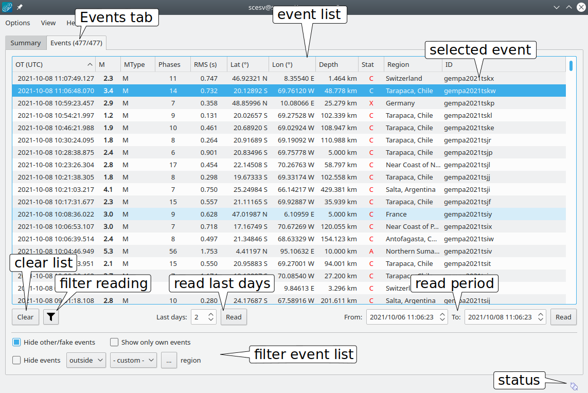
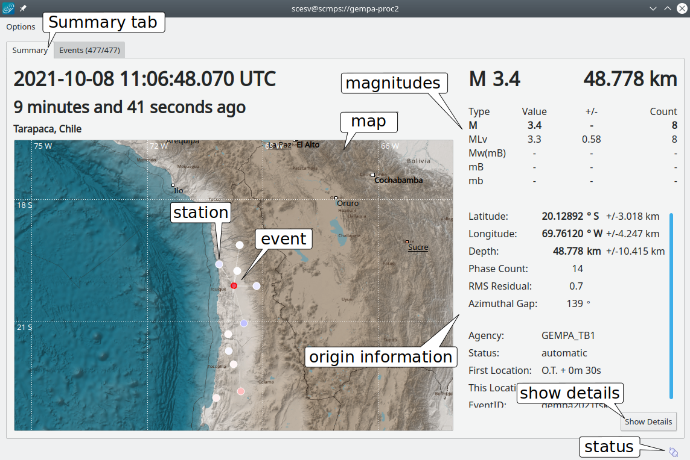

scesv is the summary display of the event parameters. It shows the primary information
about the current event including location, time, strength, type and processing status.
Additional to the current event older events can also be chosen from the eventlist in the
events tab.

The two tabs of scesv are

* Events tab showing the list of loaded events, compare Fig. :ref:`fig-events`
* Summary tab with the details of the selected event, see Fig. :ref:`fig-summary`.

.. _scesv-events-tab:

Events Tab
==========

The Events tab shows the eventlist of the time span defined on the bottom side of
the window. A the Events tab is also available for other GUIs, such as :ref:`scolv`
it can be configured in the global module configuration.
The :ref:`description of the Events tab in scolv <scolv-events-tab>` provides more
details.

.. _fig-events:

   Eventlist tab

   Tab1-2: Summary/Events tab, EventList: list of the last events with summarized information,
   List options: Show fake events, Reading 1: spinbox to limit timespan of displayed events (in days),
   Reading 2: spinboxes to limit timespan of displayed events (specified dates), Status: connection status

.. note::

   As for :ref:`scolv` filtering of the event list and custom information can be
   added to the event list by configuration. Read the scolv documentation on
   :ref:`event filtering <scolv-events-filtering>` and :ref:`custom action <scolv-custom-actions>`
   for the details.

.. _scesv-summary-tab:

Summary Tab
===========

The most recent (default) or the event selected from the event list is shown in
the Summary tab, see Fig. :ref:`fig-summary`.
Here the information are highlighted in four sections:

====================  =====================================================
section               description
====================  =====================================================
Time                  Orign time in UTC and relative to now
Region                A map of the region and location with the event and stations
Magnitude             Different magnitude types, the values and counts
Hypocenter            Origin information with location, depth, azimuthal gap etc.
====================  =====================================================

.. _fig-summary:

   Summary tab

   Tab1-2: Summary/Events tab, Origin Time: origin time in UTC and relative to now, Map: map with region
   and location and stations, Magnitude: different magnitude types with values and counts,
   Origin Info: hypocenter information with position, phase count and azimuthal gap,
   Event: earthquake location, Station: station with ray-path, Details: "Show Details" button to open
   detailed information in :ref:`scolv`, Event Type: event type combo box to set event type, Status: connection status

Hotkeys
=======

=================  =======================================
Hotkey             Description
=================  =======================================
:kbd:`F1`          Open |scname| documentation
Shift + :kbd:`F1`  Open scesv documentation
:kbd:`F2`          Setup connection dialog
:kbd:`F6`          Show propagation of P and S wave
:kbd:`F7`          Show focal mechanism by beach ball
Shift + :kbd:`F7`  Show focal mechanism by beach ball
:kbd:`F8`          Toggle auto update
:kbd:`F9`          Show raypaths and associated stations
:kbd:`F10`         Toggle tabs
:kbd:`F11`         Toggle fullscreen
Mouse wheel        Zoom map in/out
Double click       Center map
=================  =======================================
