.. raw:: html

   

.. figure:: ../../../../doc/base/media/apps/scolv-location.png
   :alt: scolv

   scolv: OriginLocatorView :ref:`Location tab <scolv-sec-location-tab>`
   with event and phase information

.. figure:: ../../../../doc/base/media/apps/scolv-picker.png
   :alt: scolv picker

   scolv: OriginLocatorView :ref:`phase picker <scolv-sec-waveform-review>`
   with waveforms and phase information

.. figure:: ../../../../doc/base/media/apps/scolv-event.png
   :alt: scolv picker

   scolv: OriginLocatorView :ref:`Event tab <fig-scolv-event>` with all origins

.. figure:: ../../../../doc/base/media/apps/scolv-magnitude-picker.png
   :alt: scolv picker

   scolv: OriginLocatorView :ref:`amplitude waveform review <scolv-sec-amplitude-review>`
   with station magnitudes

.. raw:: html

   

scolv is the main interactive tool to revise or review origin and event information.
It thus provides the entire functionality to analyze earthquake parameters:

* Phase picks and arrivals in diagrams and waveforms
* Hypocenter location and source time with uncertainties
* Focal mechanism from first-motion polarities
* Magnitudes in diagrams and waveforms
* Origin status and certainty
* Event association
* Event type

The main scolv window is divided into 4 perspectives (tabs) from which external windows
can be opened:

- :ref:`Location tab<scolv-sec-location-tab>`: Details of the selected :term:`origin` with

  * :ref:`Phase picker <scolv-sec-waveform-review>` (external window): Review
    waveforms for phase picking including polarities, uncertainties, spectra and
    spectrograms,
  * :ref:`Extended commit <scolv-sec-commit>` (external window): Commit solution
    with additional options.

- :ref:`Magnitudes tab <scolv-sec-magnitude-tab>`: Magnitude details of the
  selected origin with

  * :ref:`Amplitude waveform review <scolv-sec-amplitude-review>` (external window):
    Waveform review for measuring amplitudes and for computing magnitudes.

- :ref:`Event tab <fig-scolv-event>`: Origins and focal mechanisms referenced
  by the selected :term:`event`.
- :ref:`Events tab<fig-scolv-events>`: Table of event parameters of the loaded
  events with interactive filtering of database requests and loaded events.

Modes of Operation
==================

scolv can be operated in 2 modes:

* **Connected to the messaging** where all event and station inventory parameters
  are received from the :ref:`messaging <concepts_messaging>` or the database and
  *updated in real time*. New or updated
  parameters can be commited to the messaging. Simply start scolv without any argument
  or connect to a specific host providing the messaging, e.g.: ::

     scolv
     scolv -H [host]

* **Offline without messaging** where all event and station
  inventory parameters are read from an XML files or from the database and
  *updated interactively*. New or updated parameters can be written to an XML file.
  Open scolv with the option
  :option:`--offline` and optionally provide the database or inventory and bindings
  parameters in :term:`SCML` format to fetch event parameters as well as inventory
  and bindings configuration parameters. Examples: ::

     scolv --offline
     scolv --offline -d [database]
     scolv --offline --inventory-db [inventory] --config-db [config]

  Select one XML file in the `File` menu to read event parameters.
  After processing, the parameters can be saved to another XML file though the
  `File` menu.

.. _scolv-sec-location-tab:

Location Tab
============

The Location tab shows detailed information of the associated
phases and the residuals from the chosen origin additional information about the
hypocenter, time, station distribution, helps to find outlier.

.. _fig-scolv-location:

.. figure:: media/scolv/tab_location.png
   :width: 16cm
   :align: center

   Location tab of scolv with summary widget to the left.

   (**Redo/Undo**) Switch to last/next location result
   (**Tab 1-4**) Location/Magnitude/Event/Events tab
   (**Map**) map with the event location, associated stations, the color coded
   residuals (red-positive, blue-negative) and ray paths
   (**Information**) Origin information including time, epicentre, depth, number of
   used and available phases, RMS, azimuthal gap and minimum
   station distance
   (**List**) Table of associated arrivals (phases) containing stream information
   and phase information
   (**Tab 5-10**) Arrival residual plots against distance and azimuth (linear and
   polar) in a separate tab
   (**Plot**) Arrival residual plot (distance over residual in seconds)
   (**Depth**) Checkbox to fix to a defined depth
   (**B1**) Relocate with the given arrival information
   (**B2**) Open Manual Picker
   (**B3**) Import picks of other automatic origins belonging to the same event
   (**B4**) Compute magnitudes
   (**B5**) Commit origin
   (**Summary**) all information of the preferred origin of the loaded event

.. _scolv-sec-summary-widget:

Summary widget
--------------

The summary widget in the Location tab contains two other tabs: *Preferred* and
*Current*. *Preferred*
reflects the current official (database) state of the event while *Current*
shows the current solution (location and magnitudes). Activate the Summary widget
by pressing :kbd:`F8` or from the *View* menu.

.. note::

   The summary tab is available for all other tabs of the scolv main window and
   also for other GUI applications.

.. _scolv-sec-diagrams:

Diagrams
--------

The default arrival residual plot is shown in the figure above. Additional
plots are available to analyze arrivals which can be shown by activating the
corresponding tab.

In these diagrams, arrival can be activated or deactivating for :ref:`relocating <scolv-sec-relocating>`
by clicking on a point or by selecting a range using mouse drag. Deselecting is
available by mouse drag when pressing :kbd:`Ctrl`.

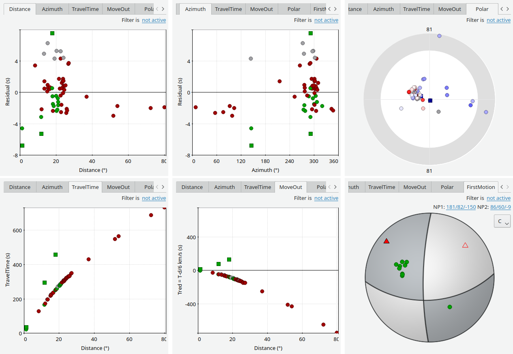

   Additional arrival plots in Location tab of the main window

   From upper left to lower right: **1**) travel-time residual vs distance, **2**)
   travel-time residual vs azimuth, **3**) azimuth vs distance in polar plot
   **4**) travel-time vs distance, **5**) corrected travel-time vs distance
   **6**) focal mechanism.

The move out plot uses the reduced travel time with a default reduction velocity
of 6km/s. This value is configurable by :confval:`olv.Pvel`, either in the configuration file
(:file:`scolv.cfg`) or in the :ref:`settings window <scolv-settings>`, e.g.:

.. code-block:: sh

   # Reduction velocity used for move out plot
   olv.Pvel = 6.0

The diagrams in the scolv Location tab present observations (e.g. arrival residuals). Each plot
is also interactive to select a subset of data or to zoom into a region.

A plot filter can be defined. Filtering means that arrivals that match the
filter are not plotted. They are filtered out visually. To enable a filter
click the link "not active" right below the plot tabs. A setup window pops up
where the filter can be defined. Currently only a filter by azimuth around
epicenter can be applied.

.. figure:: media/scolv/plot-filter-setup.png
   :width: 8cm
   :align: center

Select the center azimuth and the extent to either side. If OK is pressed all
arrivals that fall outside the defined azimuthal area are hidden from the plot
and the line below the tabs turns into "Filter is active". Clicking on the
link again and select the "None" filter will show all arrivals in the plot again.

Plots can also be configured to show or hide dashed grid lines. Use :confval:`olv.drawGridLines`
for configuration (:file:`scolv.cfg`). The default is true.

.. _scolv-sec-location-arrival-table:

Arrival table
-------------

The arrival table shows all arrivals of the current origin. The columns are
sortable by clicking on the corresponding header item. Additional data columns
can be shown or active columns can be hidden, either initially or interactively.
Available column identifiers are:

* **Used**
* **Status**
* **Phase**
* Weight
* Method
* Polarity
* Takeoff
* **Net**
* **Sta**
* **Loc/Cha**
* **Res**
* **Dis**
* **Az**
* **Time**
* **Timeres**
* Slo
* Slores
* Baz
* Bazres
* **+/-**
* Created
* Latency

The columns printed bold are shown initially. The initial column
list can be changed in :file:`scolv.cfg` by adjusting :confval:`olv.arrivalTable.visibleColumns`:

.. code-block:: sh

   olv.arrivalTable.visibleColumns = Used, Status, Weight, Phase, Net, Sta,\
                                     Loc/Cha, Res, Dis, Az, Time, +/-

The user can also interactively select what columns are be visible or hidden
from a context menu which pops up after a right click on the table header.

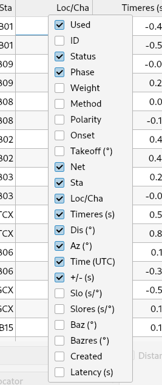

The checkbox in the first column indicates if the arrival was used for locating the
origin. The overall usage state of arrival contains three flags: arrival time used,
backazimuth used and slowness used. If any of these flags is active then the
overall usage state is active as well. The arrival table shows those flags indicated
by **T** for pick time, **S** for horizontal slowness and **B** for backazimuth.
A flag is rendered with a dash if the referred pick does not contain the
corresponding feature. For example, if a pick does not carry a backazimuth
measure then the backazimuth flag is disabled. It would not make sense to
activate backazimuth usage without a corresponding measure.

In most cases, only the time flag, indicated by the capital **T**, will be active.
The other two flags are rendered with dashes, meaning that they are inactive.
Background: an arrival refers to a pick which can hold several features. The basic
feature a pick must hold is the pick time. Some modules such as for array processing
might compute additional pick features. Such features can be the backazimuth and
the horizontal slowness. Locators like LocSAT were developed to use those features
to increase the precision of a location. Special applictions are locations based
borehole networks with poor azimuthal coverage or locations with very few stations.

There may be cases where a backazimuth measure of a pick should not be used by
the locator. In contrast, if a backazimuth is available but the timing is bad,
disabling the use of the pick time but including the backazimuth may be advantageous.
For that a simple weight value is not enough. With a weight one cannot separate
whether or not to use a particular feature. So the arrival does not only refer
to a pick but holds flags indicating which features of that pick should be used
for locating.

.. figure:: media/scolv/arrival-flags.png
   :align: center

Single or multiple rows can be selected in the table. The selection of multiple
rows works either with Ctrl+LeftMouse (add single row) or
Shift+LeftMouse (range selection).

When pressing the right mouse button on a selected row a context menu pops up.
If an unselected row is used, the current selection will be reset and only the
row below the mouse is selected.

The context menu allows to:

* Select arrivals based on a certain criterion,
* Activate/deactivate selected pick features,
* Delete selected arrivals,
* Rename phases of selected arrivals.

.. figure:: media/scolv/arrivals-context.png
   :align: center

If arrivals are deleted, they are removed physically from this solution in
contrast to deactivate an arrival where only the used flags are set to zero.

.. _scolv-sec-waveform-review:

Phase picker: review waveforms
------------------------------

The *Picker* button opens the interactive waveform picker window. It allows
to view and process waveforms for

* Picking additional phases,
* Confirming picks,
* Adding additional pick information such as polarity and uncertainty,
* Data procssing, e.g. filtering, rotation, spectrogram and much more.

The phase picker window is divided into two parts:

* The zoom trace and
* The trace list.

The zoom trace shows a sub area of the active trace in the list.

.. _fig-scolv-picker:

.. figure:: media/scolv/picker.png
   :width: 16cm
   :align: center

Request waveforms
^^^^^^^^^^^^^^^^^

When the picker window opens waveforms are initially requested for all streams
which have associated phase picks (arrivals). More waveforms can be fetched
interavtively:

#. Provide a maximum distance,
#. Click on the purple `Add` button to load the data.

Toggle viewing data without arrivals by clicking the purple `Hide` button.

During request the background of the traces is changed according to the current
state:

* Yellow: waveforms requested but not yet received.
* Red: acquisition finished and data is not available.
* Green: waveforms received and acquisition still in progress.
* Gray: meta data are missing.

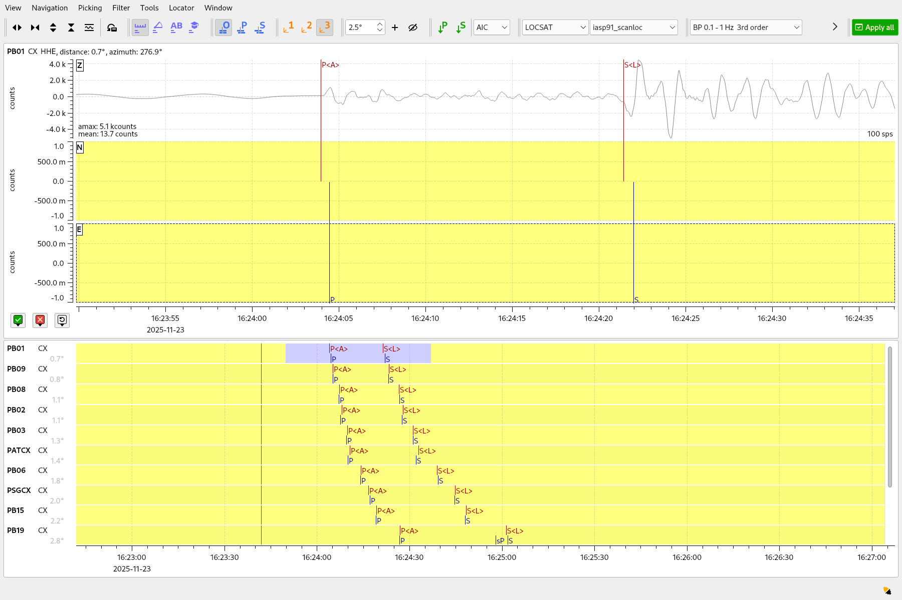

If a trace displays all three components and amplitudes are scaled up, they are
not clipped to their window area. The clipping behavior can be toggled by
either pressing :kbd:`C` or in the menu
:menuselection:`View --> Zoomtrace --> Clip components to viewport`.

The difference is shown in the following two images:

.. figure:: media/scolv/clobber-off.png
   :width: 16cm
   :align: center

   Trace clipping enabled

.. figure:: media/scolv/clobber-on.png
   :width: 16cm
   :align: center

   Trace clipping disabled

1C / 3C data
^^^^^^^^^^^^

Initially the picker window shows only the vertical channels for each station that
have been associated with the current location. When opening, it can be configured to

* Load all components: :confval:`picker.loadAllComponents`,
* Show all components: :confval:`picker.showAllComponents`.

Hotkey :kbd:`t` can be used to toggle beetween 1- and 3-component data. Use the
yellow buttons or :ref:`hot keys <sec-scolv-hotkeys>` to load components not yet
loaded.

Data filtering
^^^^^^^^^^^^^^

When the picker window opens, the waveforms are filtered by the default filter
configured in :confval:`picker.filters`. Selecting filters or unfitlered data
interactively is available by choosing the filter from the filter menu or
:ref:`hot keys <sec-scolv-hotkeys>`.

Waveform rotation
^^^^^^^^^^^^^^^^^

Waveforms can be rotated to better view details. For rotating the waveform
components into ZNE or ZRT system a new drop down list was added in the toolbar.
Selecting either ZNE or ZRT implies that all missing components are requested.

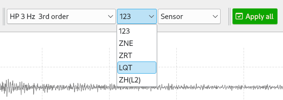

Phase picks
^^^^^^^^^^^

Phase picks shown on waveforms are color-coded:

* Red: automatic
* Green: manual
* Blue: predicted using the selected travel-time table

Mature and light colors indicate arrivals and unassociated picks, respectively.
Unassociated picks can be shown/hidden using :kbd:`Ctrl` + :kbd:`5`.

Phase picking
~~~~~~~~~~~~~

Initially the picker window allows to pick the arrival times of the following phases:

- P
- Pn
- Pg
- pP
- S
- Sg

Up to 9 phase types can be configured for selection by
:ref:`hot keys <sec-scolv-hotkeys>`. This list of favourite phases can be customized
by :confval:`picker.phases.favourites`, e.g. (:file:`scolv.cfg`): ::

   # Define a list of favourite phases for quick access
   picker.phases.favourites = Pn, P, Pg, PmP, P1, Pg, Sg, S, Sn, SmS

The list of favourites is used to assign shortcuts to. :kbd:`1` is assigned
to the first phase in the list, :kbd:`2` to the second and so on.

.. note:: Shortcuts are assigned only  to the first 9 favourite phases. All
   other defined phases can be activated from the *Picking* menu.

The phases can be also grouped to reflect e.g. regional
and teleseismic profiles. In group not hot keys are available.
An example configuration looks like this (:file:`scolv.cfg`):

.. code-block:: sh

   # Define two phase groups: regional and teleseismic
   picker.phases.groups = regional, teleseismic

   # Define all phases of group "regional"
   picker.phases.groups.regional = Pn, P, Pg, PmP, P1, Sg, S, Sn, SmS

   # Define all phases of group "teleseismic"
   picker.phases.groups.teleseismic = pP, sP, sS, PKP, PKP

.. figure:: media/scolv/phases-menu.png
   :align: center

   Pick phase selection menu

For making a phase pick the picking mode must be activated by choosing a phase in the
Picking menu. Short cuts are:

* Blue P and S buttons for picking P and phases, respectively (hot keys :kbd:`F1`, :kbd:`F2`),
* Numbers shown in the picking menu used as hot keys.

Additional information can be added interactively to the picks:

* :ref:`Pick uncertainties <scolv-sec-uncertainties>`,
* :ref:`Phase polarities <scolv-sec-polarities>`.

Press :kbd:`ESC` to leave the picking menu. To send all picks to the main scolv
window click on the red `Apply` button or press :kbd:`F5`. The picks will be used
immediately for :ref:`relocating <scolv-sec-relocating>`.

.. warning::

   All manual work will be lost when closing the picker window without sending
   the picks.

.. _scolv-sec-uncertainties:

Pick uncertainties
~~~~~~~~~~~~~~~~~~

If the mouse hovers a pick, a dashed rectangle is drawn around this pick. Then
the pick is active and the right mouse button can be pressed to open the context
menu where the polarity and uncertainty can be defined. The following screen shot
shows the available uncertainties.

.. figure:: media/scolv/pick-context2.png
   :align: center

   Pick context menu

Additionally, pick uncertainties can be defined freely whereas choosing
among a predefined set of uncertainties is a lot faster. The way, pick uncertainties
are used depends on the applied locator routine and its configuration.
To set the uncertainty of a pick more easily a list of predefined uncertainties can be
defined using :confval:`picker.uncertainties`, e.g.: ::

   picker.uncertainties = 0.05, 0.1, 0.2, "(0.1,0.2)", "(0.05,0.02)"

where single values define symmetric and pairs of values define asymmetric uncertainties.
The pre-defined uncertainties can be selected during picking using
:ref:`hot keys <sec-scolv-hotkeys>`, e.g.
:kbd:`1` or :kbd:`2` for the 1st or the 2nd value defined in :confval:`picker.uncertainties`.
Later, the uncertainties can be adjusted manually.
As for phase types, uncertainty profiles can be additionally configured (:file:`scolv.cfg`): ::

   # Define available pick uncertainty profiles. Single values
   # are symmetric uncertainties whereas tuples are asymmetric
   # uncertainties: (left,right). Uncertainty values are given
   # in seconds.

   # Define an uncertainty profile for local events
   picker.uncertainties.profile.local = 0.05, 0.1, 0.2, 0.3, "(0.1,0.2)"

   # Define an uncertainty profile for teleseismic events
   picker.uncertainties.profile.teleseismic = 0.5, 1, 2, 3, "(1,2)"

   # Define the list of uncertainty sets that are active in scolv.
   # This first set in the list is used by default. The other sets
   # can be activated in the settings dialog (scolv: F3)
   picker.uncertainties.preferred = local, teleseismic

If an uncertainty is selected, the active pick is copied into a manual pick
and the uncertainty is displayed as semi transparent bar to the left and
to the right of the pick. The width of the bar corresponds to the uncertainty
in seconds.

.. figure:: media/scolv/pick-uncertainty.png
   :align: center

.. _scolv-sec-polarities:

Phase polarities
~~~~~~~~~~~~~~~~

Furthermore the phase pick polarity can be defined. When this is the polarity
of the first arrival P phase it can be used to manually set the focal mechanisms
of the origin in the :ref:`FirstMotion <scolv-sec-diagrams>` diagram.

.. figure:: media/scolv/pick-context.png
   :align: center

Right-click on the pick to make a choice: Either *positive*, *negative*,
*undecidable* or *unset* is available. You may speed up your work by using
:ref:`hot keys <sec-scolv-hotkeys>`. If set, the polarity is displayed as an
arrow. *Undecidable* is displayed as a cross (X).

.. figure:: media/scolv/pick-polarity.png
   :align: center

.. _scolv-sec-relocating:

Relocate events
---------------

The *Relocate* button allows relocating based on the selected pick set. Picks may
be manually adjusted or created before in the
:ref:`wave review window<scolv-sec-waveform-review>` or arrival properties may
be directly adjusted in the :ref:`arrival table <scolv-sec-location-arrival-table>`.
Prior to relocating choose the locator, the locator profile and additional parameters
to the right or from the the tool box.

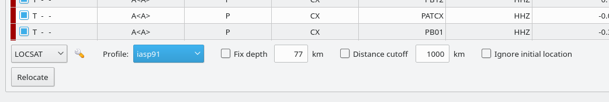

Defaults may be configured, e.g.

* :confval:`olv.locator.interface`: Default locator
* :confval:`olv.locator.defaultProfile`: Default profile of the default locator
* :confval:`olv.locator.minimumDepth`: Minimum depth for the locator to consider.

The locators available by default in |scname| are

* :ref:`LOCSAT <global_fixedhypocenter>`,
* :ref:`FixedHypocenter <global_locsat>`.

Additional locator routines are available by :ref:`concepts_plugins` which
provide their own specific global configuration, e.g.

* :ref:`Hypo71 <global_hypo71>`,
* :ref:`NonLinLoc <global_nonlinloc>`,
* iLoc (currently only on when :ref:`building SeisComP from source <build>`).

Any other custom locator can be intergrated through configuration of
:ref:`global_locext`.

Pressing *Relocate* creates a new origin and updates the arrival table and the
parameters displayed in the Location tab.

.. hint::

   You need to create a new origin for :ref:`computing magnitudes <scolv-sec-magnitudes>`.

.. _scolv-sec-magnitudes:

Compute magnitudes
------------------

When an event was :ref:`relocated <scolv-sec-relocating>` a new origin is created
and new magnitudes can be calculated by using the
"Compute Magnitudes" button. The advantage of calculating the magnitudes before
committing the new origin, is the possibility to check the resulting magnitudes
before they are computed manually by :ref:`scmag`.

.. _fig-scolv-location-mag-status:

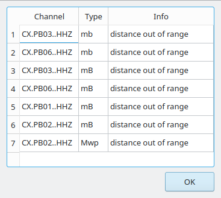

   Compute magnitudes status window

:ref:`A window <fig-scolv-location-mag-status>` will pop up showing the progress
information of computation. The amplitudes are either fetched from database if
the pick is unchanged and already in the system. For new manual picks,
waveforms are requested to compute the amplitudes. The popup window contains
information about the progress and possible errors. After closing this windows
all available magnitudes are shown and can be interactively re-processed
in the :ref:`magnitudes tab <scolv-sec-magnitude-tab>`.

.. _scolv-sec-commit:

Commit a solution
-----------------

Committing a solution means to send the location (including optional magnitudes)
to the processing system and let it decide what origin becomes preferred.

To optimize the workflow

1. Select an event
2. Review solution
3. Commit solution
4. Change to event tab
5. Set this solution preferred
6. Set event type
7. Change to events tab
8. Goto 1.

This may be replaced by

1. Select an event
2. Review solution
3. Commit solution
4. Change to events tab
5. Goto 1.

An additional commit mode was added which allows to set certain parameters and
options along with the location and its magnitudes.

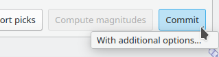

After pressing and holding the Commit button down for a little while, a menu
pops up which allows to select *With additional options*. Selecting this entry
brings up another window where the different options can be set.

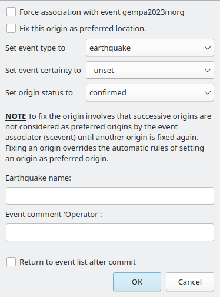

It allows to fix the origin to be committed as preferred origin and to set the
event type in one go. If *Return to event list after commit* is ticked, the
event list is activated after pressing OK to select another event quickly.

*Earthquake name*
 Contains the event description *earthquake name*. If this field is empty, the
 description will be removed from the event otherwise it will be added.

*Comment*
 contains an optional event comment added as comment with ID *Operator*.

.. _sec-scolv-custom-commit:

As a shortcut for committing with additional options,
:ref:`custom commit buttons <fig-scolv-custom-commit>` can be added by
configuration: Add, enable and configure a custom commit profile in
:confval:`olv.customCommits`.
With custom commit buttons origin and event paramters can be set, e.g.:

* Origin status
* Fixing the origin
* Event type
* Event type certainty
* Magnitude type of the :term:`preferred magnitude`. The preferred magnitude
  can also be set in the :ref:`magnitude tab <scolv-sec-magnitude-summary>`.
* Event comments

.. _fig-scolv-custom-commit:

.. figure:: media/scolv/commit-custom.png
   :width: 16cm
   :align: center

   Custom commit buttons in the Location tab for configured actions and with specific label and color.

.. _scolv-sec-magnitude-tab:

Magnitudes Tab
==============

The Magnitude tab shows all available magnitude information for the current
origin. They can be recomputed after creating a new origin, e.g. by relocating.

.. _fig-scolv-magnitudes:

.. figure:: media/scolv/tab_magnitudes.png
   :width: 16cm
   :align: center

   Magnitudes tab of scolv.

   (**Map**) Map with residual and status of the station magnitude, filled
   circles show stations which delivered a magnitude, empty circles represent
   for which no magnitude was calculated
   (**Magnitude tabs**) Each magnitude and the residuals are displayed in a
   separate tab, no residuals are displayed for deduced magnitudes like
   Mw(mB) or M
   (**Information**) Magnitude information including network magnitude value,
   magnitude error, number of used and available station magnitudes and
   minimum/maximum station magnitude
   (**List**) Station magnitude table with weights
   (**Plot**) Station magnitude residual from network magnitude (distance
   over residual)
   (**Weighting**) Weighting scheme for the network magnitude
   (**B1**) Recalculation of the network magnitudes
   (**B2**) Open waveform review

.. _scolv-sec-magnitude-station:

Station magnitudes
------------------

For each of the different magnitude types (e.g. mb, mB, MLv, Mw(mB)),
the :ref:`station magnitudes <scmag-stationM>` are shown in the magnitude residual plot and the table.
The residual plot visualizes the difference between the station magnitude and
the network magnitude for the different station distances. After relocation the
magnitudes can be recalculated by the "Compute Magnitudes" button in the
Location tab.

The station magnitudes can also be recalculated by
:ref:`interactive waveform analysis<scolv-sec-amplitude-review>`. Press the B2 button to
start the interactive analysis.

.. important:: Magnitudes cannot be recalculated for origins loaded from
   database. To review magnitudes, create a new origin (relocate), recompute
   magnitudes and then change into this tab to open either the waveform
   review window or to just remove outliers.

.. _scolv-sec-magnitude-network:

Network magnitudes
------------------

:ref:`Network magnitudes <scmag-networkM>` are computed from corresponding
:ref:`station magnitudes <scmag-stationM>`.
The considered station magnitudes can be selected or unselected in the
list and in the plot of station magnitudes. The method, the status and the margins
to disregard outliers can be selected.
Normally, the 25%-trimmed mean is calculated as network magnitude to stabilize
the result against a few outliers. The 25%-trimmed mean first removes the outliers
of the outer 12.5% percentiles and then forms the mean.

Magnitudes that were not computed due to missing data or low signa-to-noise
ratios have a cross button rendered in their tab headers and their value is
nan (not a number). Furthermore was the status of the magnitude set to
rejected. To manually review the waveforms and to fine tune the
parameters, open the waveforms and add at least one station magnitude. Otherwise
the rejected magnitude will be removed from the origin prio to committing it.

.. _scolv-sec-magnitude-summary:

Summary magnitude
-----------------

The :ref:`summary magnitude <scmag-summaryM>` typically is calculated from all network magnitudes
by :ref:`scmag` and set as preferred magnitude type by :ref:`scevent` after committing
or confirming an origin. The defaults can be changed by configuring :ref:`scmag`
and :ref:`scevent`.

However, in combination with :ref:`custom commit buttons <sec-scolv-custom-commit>`,
the network magnitude to be considered as the preferred can be set by hitting this
configured button or interactively in the :ref:`magnitude tab <fig-scolv-magnitudes>`
of scolv. Interactively check the box in the network magnitudes tab, then press the
custom commit button. Setting the preferred magnitude interactively in the magnitude
tab takes priority over the configuration of the custom commit button.

.. _scolv-sec-amplitude-review:

Waveform review
---------------

The magnitude review page also allows the review of waveforms.
The button *Waveforms* brings up the amplitude waveform review page.
The waveform review magnitude type is the same as the currently active tab.

.. figure:: media/scolv/magnitudes-waveforms.png
   :width: 16cm
   :align: center

The initial view loads all traces of all arrivals within the defined distance
for that magnitude type. The zoom trace shows all components required for this
particular amplitude type and the lower part shows all stations and only the
currently active component. All traces are aligned on trigger time (blue P marker).
If a station has got an amplitude, it shows up as a red (automatic
determined amplitude) or green (manually determined amplitude) marker.
This display is similar to the Picker.

The toolbar contains two lines of settings. The first line is similar to the
Picker, the second line is amplitude picker specific.

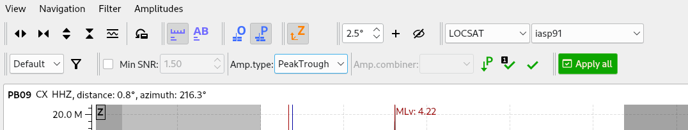

   Second toolbar line: filter selection, filter toggle, min SNR editor,
   amplitude measurement type selector, amplitude combiner selector,
   (re)calculate amplitudes, apply amplitudes.

A station trace is divided into three areas:

* Dark gray: unused data
* Light gray: data used for noise offset and noise amplitude
* White: data used for amplitude calculation

The example above shows nicely how different data time windows are used for
amplitude determination depending on the distance. This depends on the
amplitude type and its implementation.

Available actions are:

* Show raw data
* Change processing settings
* Adjust processing areas (noise, signal) for a single trace or all traces
* Apply a secondary filter (e.g. to remove noise or low frequencies)
* Pick amplitudes within a user definable time window
* Add unpicked/unassociated stations that are within a certain distance
* Remove bad stations

Filtered and raw data
^^^^^^^^^^^^^^^^^^^^^^

By default the processed waveforms are displayed. The processing is defined by
the magnitude type. To view the raw waveforms change the filter drop down box
to *Raw*.

Processing settings
^^^^^^^^^^^^^^^^^^^

A basic amplitude processor uses two basic settings: Minimum signal/noise
ratio (SNR) and data time windows. The default minimum SNR is defined by the
implementation of the amplitude algorithm. This default SNR is shown in the
toolbar right from *Min SNR:*. In some situations an operator might want to
increase or decrease the minimum SNR for some reason. This can be done by
modifying the value in the corresponding spin box.

In the time scale of the zoom widget and the overview three black triangles are
visible. Those triangles can be used to adjust the data time windows of either
the zoom trace (upper part) or all traces (lower part) by dragging the handle
with the left mouse button.

Some amplitude processors allow the modification of the type of amplitude
measurement (e.g. absolute maximum or peak-to-peak) and/or the amplitude
combiner procedure. This procedure is mostly used when a final amplitude from
two components is computed, e.g. ML on the horizontals. The combiner procedure
defines how the amplitudes of each horizontal are combined to a single amplitude,
e.g. by taking the maximum of both or the average.

If the amplitude processor allows any of these options, the corresponding drop
down boxes are enabled in the toolbar and can be used to change the defaults.

.. note:: Amplitudes are not recalculated if any changes to the settings are
   made. Recalculation has to be activated manually (see below).

Secondary filters
^^^^^^^^^^^^^^^^^

Another option is to filter the data additionally to the internal filter of the
amplitude processor. Be warned that wrongly applied filters screw up the results.
The available filters can be defined in the settings dialog of scolv or in the
configuration file similar to the manual picker filters (:file:`scolv.cfg`):

.. code-block:: sh

   # List of filters available in the picker. Format:
   # "name1;filter-definition1", "name2;filter-definition2"
   amplitudePicker.filters = "4 pole HP @2s;BW_HP(4,0.5)"

The new filter selection is applied immediately to the waveforms while the amplitudes are not recalculated
(see next section).

Calculate amplitudes
^^^^^^^^^^^^^^^^^^^^

To calculate the amplitudes of all traces with the current settings press the
green check in the toolbar. It will process all traces and recalculate the
amplitudes within the shown time windows. If an error occurs, it will show up as
a small message box in the station trace itself. If a new amplitude is available,
its state is set to manual and the marker is updated to reflect the new position
of the amplitude. If the mouse hovers an amplitude marker, a tooltip pops up
after a certain amount of time and shows information about the amplitude.

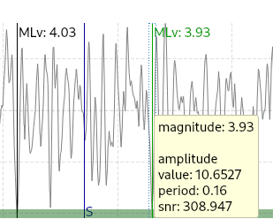

Pick amplitudes
^^^^^^^^^^^^^^^

In addition to the default picking of all stations it is also possible to
define the time window of the amplitude of a station manually. To do so,
activate picking by pressing :kbd:`1` or in the main menu:
:menuselection:`Amplitudes --> Pick amplitudes`.

There are two modes of picking:

#. Create a time window by pressing with left mouse button at the start time and
   releasing at the end time, or
#. Double click at a time and use a time window of [t-0.5sec;t+0.5sec]

Add stations in range
^^^^^^^^^^^^^^^^^^^^^

Unpicked or unassociated stations can be added the same way as in the manual
picker. The new stations will not have an amplitude and need either manual
picking or global amplitude recalculation.

Remove bad stations
^^^^^^^^^^^^^^^^^^^

Stations can be disabled by either double clicking on the trace label in the
overview or by deactivating an amplitude similar to deactivating a pick.

Confirm the amplitudes
^^^^^^^^^^^^^^^^^^^^^^

The red button in the toolbar confirms all amplitudes and transfers them to the
magnitude review page. Only activated amplitudes are transferred. Disabled
stations or disabled amplitudes are ignored. At this stage all magnitudes are
calculated and the network magnitude is calculated according to the available
settings: *Mean*, *Median* or *Trimmed mean*.

Event Tab
=========

The Event tab gives all information of associated origins and magnitude of the
actual event. Here the selection of the preferred origin and preferred magnitude
can be influenced independent from :ref:`scevent`. The messaging between
scevent and scolv about the selected origins and magnitudes can be viewed in
a window that has to be opened by pulling the left side frame to the right.

.. _fig-scolv-event:

.. figure:: media/scolv/tab_event.png
   :width: 16cm
   :align: center

   Event tab of scolv.

* **Origin list:** List of all associated origins
  * **B1** Selector for the event type
  * **B2** Button to fix the selected origin as preferred
  * **B3** Button to let :ref:`scevent` select the preferred origin

* **Magnitude list** List of magnitudes of the actual origin
  * **B4** Button to fix the selected magnitude as preferred
  * **B5** Button to let :ref:`scevent` select the preferred magnitude

* **Focal Mechanism:** List of all focal mechanisms associated to the selected event.

The map (lower left part) shows all associated origins while the currently
selected origin (**Origin list**) is drawn filled.

.. _scolv-origin-list:

Origin list
-----------

The Origin list shows details of all available origins. You may fix/unfix an
origin to become the preferred one or select the type and set
the type uncertainty for the selected sevent.

Select a row or cell and
press the right mouse button to copy the row or cell, respectively.
The *Stat* column indicates a combination of the mode and the status of the origin.

.. _scolv-origin-mode:

The mode is color coded:

* **Red**: automatic
* **Green**: manual

.. _scolv-origin-status:

The status is coded by a single character:

* **A**: unset, status not specifically set, e.g. usually automatic origins from :ref:`scautoloc`
* **F**: final
* **V**: reviewed
* **C**: confirmed
* **P**: preliminary, e.g. XXL origins from :ref:`scautoloc`
* **R**: reported
* **X**: rejected

.. _scolv-magnitude-list:

Magnitude list
--------------

The magnitude list shows all available magnitudes available for the origin
selected in the :ref:`Origin list <scolv-origin-list>`. You may fix/unfix a
magnitude type to become the preferred magnitude.

Select a row or cell and
press the right mouse button to copy the row or cell, respectively.

.. _scolv-fm-list:

Focal Mechanism list
--------------------

The Focal Mechanism tab shows all focal mechanisms and moment tensors associated
to the selected event. You may fix the preferred mechanism or fix/unfix :term:`Mw`
to become the preferred magnitude.

Select a row or cell and
press the right mouse button to copy the row or cell, respectively.

.. _scolv-events-tab:

Events Tab
==========

The Events tab gives an overview of the events in the defined time span. Listed
events are updated in real time as new events arrive in |scname| or are loaded
from the database. The title of the tab also indicates the number of shown vs.
the total number of loaded events. The numbers can be different because events
can be :ref:`hidden from the list by filtering <scolv-events-filtering>`.

When starting scolv with the option **--offline**, events can also be loaded from an XML
file using the File menu in the main window.

.. _fig-scolv-events:

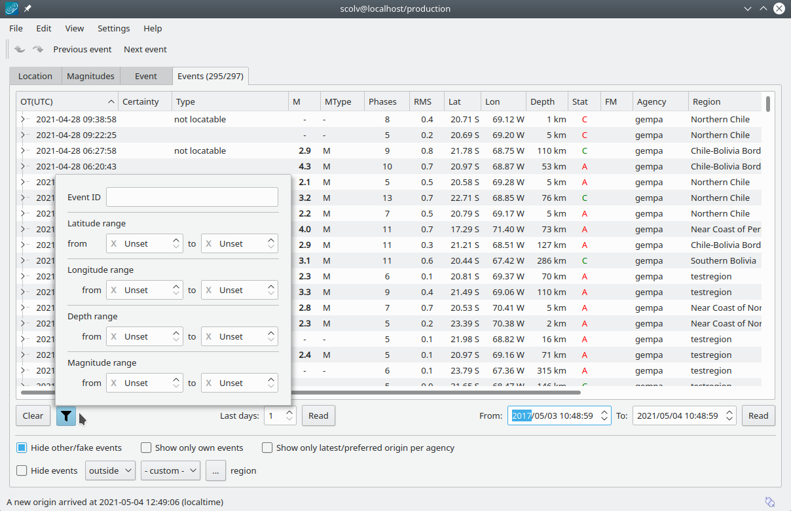

   scolv Events tab with the list of events and the filter window.

Information about origin time, preferred ("best") magnitude, preferred magnitude
type, number of phases, epicenter and depth, origin status, region, agency and
event/origin ID are similar to the event list in :ref:`scesv`. Additionally,
all origins associated with one event are displayed if an event item is expanded.

.. note::

   The region name of an event is read from the database or received via the
   messaging bus. It is an integral part of the event description and set based
   on the data set available at the time of the event creation. The region name
   of the origins is not part of the origin description and resolved dynamically
   when the information is required. That can lead to confusion if the dataset
   of the computer where the event has been created and the local dataset
   differs. Therefore the region names resolved locally are rendered with italic
   font style.

Events table
------------

As with the arrival table the shown columns of the list are also configurable.
The available identifiers are:

* **OT(GMT)** : origin time
* **Type** : event type
* M : magnitude
* **MType** : magnitude type
* **Phases** : number of used phases
* **RMS** : root-mean square travel-time residual
* AzGap: largest azimuthal gap between two neighboring stations of an origin
* **Lat** : latitude
* **Lon** : longitude
* **Depth** : depth
* DType : depth type
* **Stat** : a combination of the :ref:`color-coded mode <scolv-origin-mode>` and
  the :ref:`status<scolv-origin-status>` of the preferred origin as described by
  a letter. A trailing "+" indicates that origins were contributed to the event
  by multiple agencies, e.g. "C+".
* FM : focal mechanism
* Origins: number of origins per event
* **Agency** : agency ID
* Author : author
* **Region** : region name
* **ID** : ID of the show element, e.g. event or origin

The bold identifiers are visible initially.
To show or hide columns interactively click with the right mouse button on the
table header and check or uncheck the corresponding column.

Sorting and re-ordering is available by clicking on the header of the columns and
by dragging the header fields, respectively. Right-click on cells to copy individual
cells values or entire rows.

This list can also be customized
with :confval:`eventlist.visibleColumns` in the global configuration
(:file:`scolv.cfg` or :file:`global.cfg`):

.. code-block:: sh

   # Remove Type and Author from column list that is initially active
   eventlist.visibleColumns = OT(GMT), Type, M, MType Phases, RMS, Lat, Lon,\
                              Depth, DType, Stat, FM, Author, Agency, Region, ID

.. _scolv-events-filtering:

Event filtering
---------------

Database request filters can be applied interactively or automatically by

* **Interactive custom request filters**: You may set and adjust a custom request
  filter** in the filter parameter window which opens when pressing the Filter
  button. Press *Read* to reload the events list based on the filter parameters.
  **The interactive custom request filter only concerns the
  database request for loading events. It does not update the current list.**
  Use the :ref:`global` for presetting the values (:file:`scolv.cfg` or
  :file:`global.cfg`), e.g.:

  .. code-block:: sh

     eventlist.filter.database.minlat = 51.0

* **Preset filters** based on

  * **Event type:** Activate by check box *Hide other/fake events*. If checked, all
    events with the configured types are hidden from the list. The default event types
    to hide are *not existing* and *other* are hidden. If unchecked, the filtering
    is inactive and the events are shown. **Pressing the Hide button only affects
    the currently loaded list.** Configure the event types used for this filter as well
    as the label text for the checkbox.
    Use the :ref:`global` for presetting the values s (:file:`scolv.cfg` or :file:`global.cfg`):

    .. code-block:: sh

       # Define the event types to be filtered
       eventlist.filter.types.blacklist = "not existing", "other",\
                                          "outside of network interest"

       # Define the label of the button to filter the events
       eventlist.filter.types.label = "Hide fake events"

       # Define the default behavior
       eventlist.filter.types.enabled = true

  * **Agency**: Activate by check boxes *Show only own origin* and/or "Show only
    latest/preferred origin per agency". The button *Show only own events*
    will hide all events where the preferred origins agencyID is not the configured
    :confval:`agencyID` of scolv. This is the default behavior which can be customized
    (:file:`scolv.cfg` or :file:`global.cfg`):

    .. code-block:: sh

       # Set the preferred agencyIDs to GFZ and EMSC
       eventlist.filter.agencies.whitelist = GFZ, EMSC

       # Set type to 'origins' which means that an event will pass the filter if
       # at least one origin is from a preferred agency defined with the whitelist
       # above. The default type is 'events' which checks only the events preferred
       # origin.
       eventlist.filter.agencies.type = origins

       # Defines the text of the option "Show only own events".
       eventlist.filter.agencies.label = "Show only own events"

       # Enable this filter initially. If this option is not used, the filter
       # is disabled by default.
       eventlist.filter.agencies.enabled = true

  * **Source region:** Select a source region, activate "Hide events" and choose to
    hide events inside or outside the region.
    **Pressing the Hide button only affects the currently loaded list.**
    Pre-defined regions can be configured in the global configuration
    (:file:`scolv.cfg`, :file:`global.cfg`):

    .. code-block:: sh

       # Configured a list of regions that can be used as filter of the result set.
       eventlist.filter.regions.profiles = chile

       # Defines the name of the region that shows up in the listbox.
       eventlist.filter.regions.region.chile.name = Chile

       # Defines a rectangular region with a list of 4 values: latmin, lonmin, latmax,
       # lonmax.
       eventlist.filter.regions.region.chile.rect = -40, -80, -10, -60

.. _scolv-custom-actions:

Custom Actions
==============

Since the internal data model is limited, scolv allows
deriving custom quantities from the event or origin objects. These quantities can
be displayed or processed further by external script.
This procedure can help to evaluate origins in a better or more specific way.

Two sources of information are currently supported

* :ref:`Origin comments <sec-scolv-comments>` provided along with origins to be
  shown in scolv tabs,
* :ref:`External scripts <sec-scolv-scripts>` provided by the |scname| operator
  to extract specific information from events or origins which are shown in tabs
  or processed further.

.. _sec-scolv-comments:

Origin comments
---------------

Currently only one comment of an origin can be added to the different panels.

Location tab
^^^^^^^^^^^^

To add an origin comment value to the information panel of the Location tab,
configure display paramters in scolv. Example (:file:`scolv.cfg`):

.. code-block:: sh

   # Define the comment id to be used
   display.origin.comment.id = SED.quality

   # Define the default display value if no comment is available
   display.origin.comment.default = "-"

   # Define the label text in the information panel for this value
   display.origin.comment.label = Quality

Event tab
^^^^^^^^^

To add a custom column to the **origin list of the Event tab** showing an origin
comment value, configure eventedit parameters in scolv or global. Example
(:file:`scolv.cfg` or :file:`global.cfg`):

.. code-block:: sh

   # Define the default value if no comment is present
   eventedit.origin.customColumn.default = "-"

   # Define the comment id to be used
   eventedit.origin.customColumn.originCommentID = SED.quality

   # Define the column header label
   eventedit.origin.customColumn.name = "Qual"

   # Define the column position in the table
   eventedit.origin.customColumn.pos = 4

   # Allows to map comment values (strings) to colors. In this case the
   # comment will have A,B,C or D which is mapped to green, yellow, orange and
   # red
   eventedit.origin.customColumn.colors = "A:00FF00","B:rgb(64,192,0)",\
                                           "C:rgb(192,64,0)","D:FF0000"

Events tab
^^^^^^^^^^

To add a custom column to the **event list of the Events tab** using a comment
value, configure eventlist parameters in scolv or global. Example
(:file:`scolv.cfg` or :file:`global.cfg`):

.. code-block:: sh

   # Define the default value if no comment is present
   eventlist.customColumn.default = "-"

   # Define the comment id to be used
   eventlist.customColumn.originCommentID = "SED.quality"

   # Define the column header label
   eventlist.customColumn.name = "Qual"

   # Define the column position in the table
   eventlist.customColumn.pos = 5

   # Allows to map comment values (strings) to colors. In this case the
   # comment will have A,B,C or D which is mapped to green, yellow, orange and
   # red
   eventlist.customColumn.colors = "A:00FF00","B:rgb(64,192,0)",\
                                   "C:rgb(192,64,0)","D:FF0000"

The last three examples are used to show the *SED.quality* comment value which
is set by the :ref:`NonLinLoc locator plugin <global_nonlinloc>`.

.. _sec-scolv-scripts:

External scripts
----------------

User-defined scripts may generated and executed

* By :ref:`custom buttons <sec-scolv-buttons>`
* Automatically to show :ref:`custom information <sec-scolv-information>` in the
  Location, Event and the Events tabs.
  The information may include parameters derived from origins.

.. _sec-scolv-buttons:

Custom buttons
^^^^^^^^^^^^^^

scolv allows to add one custom button to the **Summary window** and two custom
buttons to the **Location tab**.
When pressing the custom buttons, user-defined external scripts are executed.
Configuration (:file:`scolv.cfg`):

* Button in Summary window: :confval:`scripts.export`. Read :confval:`scripts.export`
  for the description of the parameters passed to the script.
* Up to 2 buttons in Location tab: :confval:`button0`, :confval:`scripts.script0`,
  :confval:`button1`,  :confval:`scripts.script1` Read :confval:`scripts.script0`
  and :confval:`scripts.script1` for the description of the parameters passed to
  the scripts.

.. _sec-scolv-information:

Custom information in tabs
^^^^^^^^^^^^^^^^^^^^^^^^^^

Origin parameters can be derived by external scripts.
When configured for the scolv tabs *Location*, *Event* or *Events*, scolv will call
those scripts and writes a binary serialized origin object
to its standard input. scolv reads the script output and displays this value
only if the return code of the script is 0.

Below you find examples for

* Example custom script
* :ref:`Custom information in the Location tab <sec-scolv-parameters-location>`
* :ref:`Custom information in the Event tab <sec-scolv-parameters-event>`
* :ref:`Custom information in the Events tab <sec-scolv-parameters-events>`

An example script which just returns the standard error looks like this:

.. code-block:: python

   #!/usr/bin/env seiscomp-python
   from __future__ import print_function
   import sys
   from seiscomp import datamodel, io

   def main():
       ar = io.BinaryArchive()

       # Open standard input
       if not ar.open("-"):
           # Hmmm, opening stdin failed
           return 1

       # Read the object
       obj = ar.readObject()
       ar.close()

       # Try to cast obj to an origin
       org = datamodel.Origin.Cast(obj)
       # No origin -> error
       if not org:
           return 1

       # Try to print the standard error to stdout
       try:
           print(org.quality().standardError())
       # Field not set, return error
       except Exception:
           return 1

       return 0

   if __name__ == "__main__":
       sys.exit(main())

.. important:: The script must be executable. In Linux don't forget
   to call

   .. code-block:: sh

      chmod +x /path/to/script

As many scripts as necessary for evaluation can be created.

.. warning::

   Calling external scripts causes overhead and can take some time
   depending on the implementation of the script. scolv needs to access the
   database to fetch additional information which it does not need normally.
   The slower the database access, the longer it takes to display the results.

.. _sec-scolv-parameters-location:

Location tab
~~~~~~~~~~~~

To add the output of an external custom script to the information panel of the Location tab,
configure display parameters in scolv. Example (:file:`scolv.cfg`):

.. code-block:: sh

   # Define the available add-ons to be used
   display.origin.addons = qual, qual2

   # Configure each add-on
   display.origin.addon.qual1.label = "Qual1"
   display.origin.addon.qual1.script = "@CONFIGDIR@/scripts/scolv/qual1"

   display.origin.addon.qual2.label = "Qual2"
   display.origin.addon.qual2.script = "@CONFIGDIR@/scripts/scolv/qual2"

.. _sec-scolv-parameters-event:

Event tab
~~~~~~~~~

Provide an external script and add the output to the **origin list of the Event tab**,
configure the eventedit parameters in scolv or global. Example (:file:`scolv.cfg` or :file:`scolv.cfg`):

.. code-block:: sh

   eventedit.scripts.columns = qual1, qual2
   eventedit.scripts.column.qual1.label = "Qual1"
   eventedit.scripts.column.qual1.pos = 8
   eventedit.scripts.column.qual1.script = "@CONFIGDIR@/scripts/scolv/qual1"
   eventedit.scripts.column.qual2.label = "Qual2"
   eventedit.scripts.column.qual2.pos = 9
   eventedit.scripts.column.qual2.script = "@CONFIGDIR@/scripts/scolv/qual2"

.. _sec-scolv-parameters-events:

Events tab
~~~~~~~~~~

Provide an external script and add the output to **event list of the Events tab**,
configure the eventlist parameters in scolv or global. Example (:file:`scolv.cfg` or :file:`global.cfg`):

.. code-block:: sh

   eventlist.scripts.columns = qual1, qual2
   eventlist.scripts.column.qual1.label = "Qual1"
   eventlist.scripts.column.qual1.pos = 5
   eventlist.scripts.column.qual1.script = "@CONFIGDIR@/scripts/scolv/qual1"
   eventlist.scripts.column.qual2.label = "Qual2"
   eventlist.scripts.column.qual2.pos = 6
   eventlist.scripts.column.qual2.script = "@CONFIGDIR@/scripts/scolv/qual2"

Adding external scripts to the event list is the most expensive part. Whenever
the event list is reloaded, it will start to run the scripts on all origins
in the background. It can take a while until the complete list has been
processed. A progress indicator is plotted in the middle of the event list while
the background processes are running.

.. _scolv-settings:

Settings
========

All settings of scolv can be adjusted in its :ref:`configuration file <scolv_configuration>`.
However, some settings can be changed on-the-fly. The connection to the messaging
system and the database can be adjusted in the *Setup connection* dialog access
by pressing :kbd:`F2`. A window for adjusting scolv settings is
available which can be opened by pressing :kbd:`F3`.

.. warning::

   When pressing the Save button in the scolv settings menu, the parameters will be written
   to :file:`$HOME/.seiscomp/scolv.cfg` (use mode configuration) where they take
   priority over configurations in :file:`$SEISCOMP_ROOT/etc/scolv.cfg` (system mode configuration).

Global
------

This section contains settings for all the main tabs and *all* waveform windows.

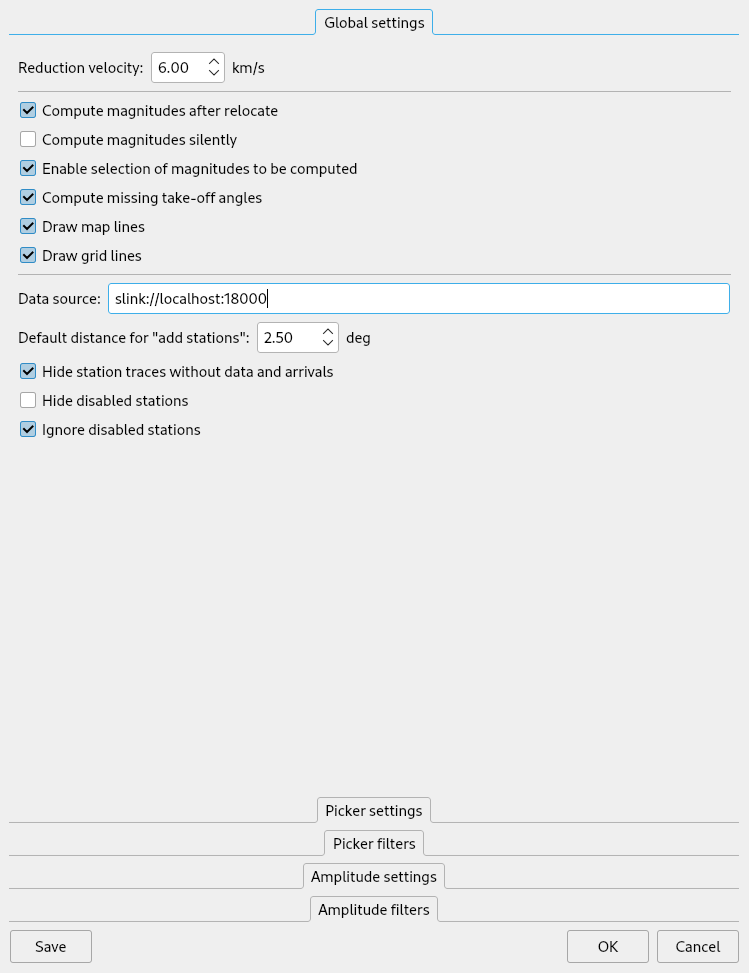

   Global settings

*Reduction velocity*
 Sets the reduction velocity used for plot *MoveOut*.

*Compute magnitudes after relocate*
 Automatically computes magnitudes after each relocation. This has the same
 effect as pressing "Compute magnitudes" manually.

*Compute magnitudes silently*
 Automatically closes the compute magnitudes dialog if the computation is
 finished and no error occurred.

*Draw grid lines*
 Enables dashed grid lines in all plots.

*Data source*
 Defines the waveform data source for both, pick review and amplitude review

*Default distance for "add station"*
 The default value to add stations (traces) that have not been picked or
 associated is 15 degrees. A lower value can be defined, e.g. if mainly local events are analyzed.

*Hide station traces without data and arrivals*
 If new stations are added during pick review or amplitude review and if no
 data is available for some of those stations, they will be hidden and not
 shown. Once data arrives the trace becomes visible.

Picker
------

This section contains settings for the picker window.

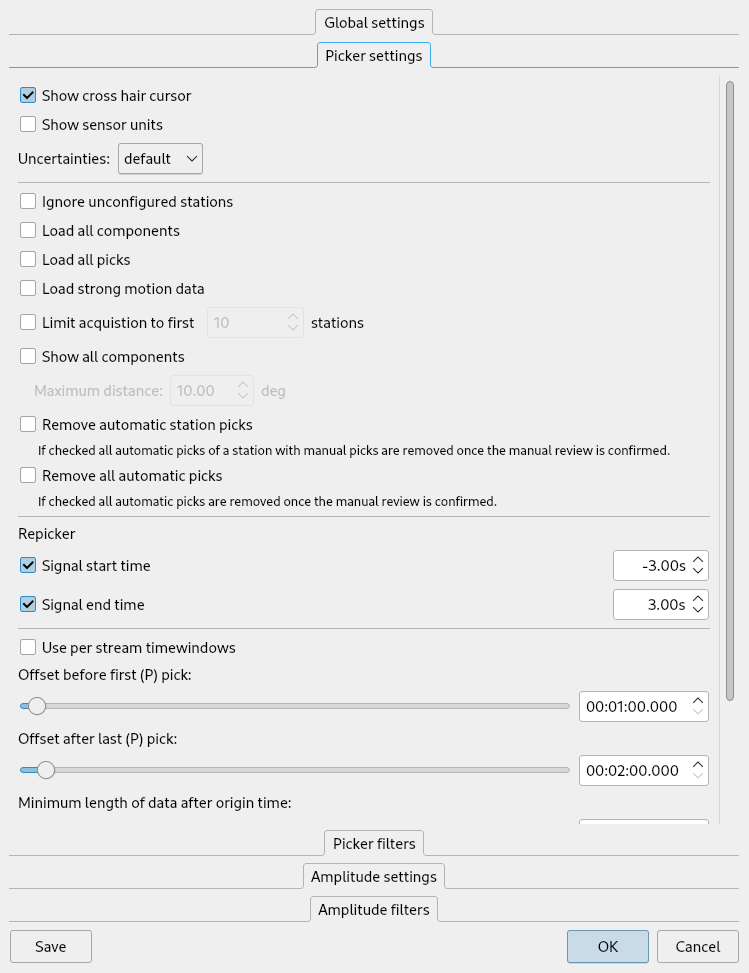

   Waveform picker settings

*Show cross hair cursor*
 Enables the cross hair cursor which shows the currently selected uncertainty
 ranges.

*Uncertainties*
 Select the current uncertainty set to be used (:confval:`picker.uncertainties.preferred`).

*Remove automatic station picks*
 If checked all automatic picks of a station with manual picks are removed once
 the manual review is confirmed.

*Remove all automatic picks*
 If checked all automatic picks are removed once the manual review is confirmed.

Magnitude review
----------------

This section contains settings for the magnitude waveform review window.

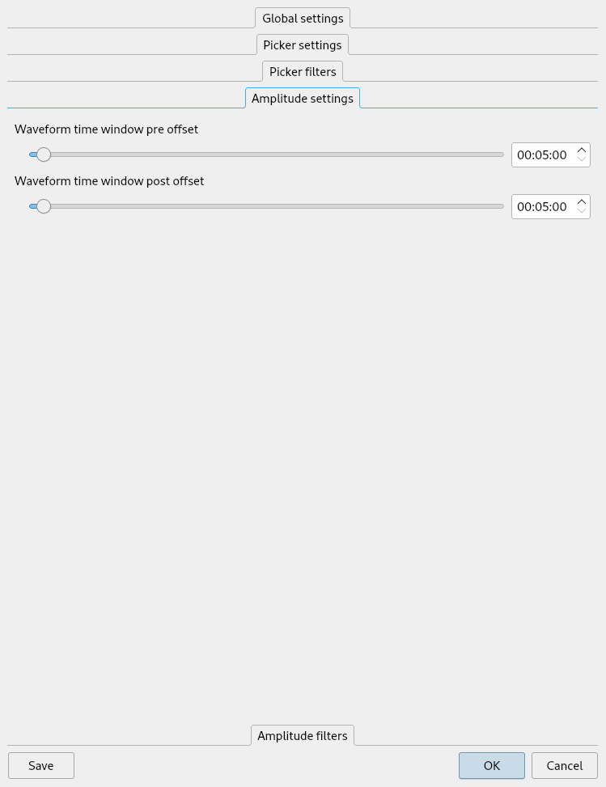

   Amplitude/magnitude review settings

*Waveform time window pre offset*
 Sets an offset before the used amplitude time window that is used when
 collecting data.

*Waveform time window post offset*
 Sets an offset after the used amplitude time window that is used when
 collecting data.

 The greater the offset the more the amplitude time window can be extended or
 shifted.

Units and precisions
--------------------

Local network users prefer the distance unit in kilometers while others prefer degrees.
scolv (as any other GUI) can be configured to show either the one or the other.

.. code-block:: sh

   # If true, show distances in km. Use degree otherwise.
   scheme.unit.distanceInKM = true

Furthermore the precision of various values can be configured:

.. code-block:: sh

   # Precision of depth values.
   scheme.precision.depth = 0
   # Precision of latitude/longitude values.
   scheme.precision.location = 2
   # Precision of magnitude values.
   scheme.precision.magnitude = 2
   # Precision of pick times (fractions of seconds).
   scheme.precision.pickTime = 1

.. note::

   Configuring units and precisions only affects the way the values are presented,
   not the values themselves. These and other lock-and-feel parameters can be
   adjusted in *scheme* section of the :ref:`global configuration <global>`.

.. _sec-scolv-hotkeys ::

Hotkeys
=======

The following table describes the available key combinations and their triggered
actions in scolv. The hotkeys are provided for:

* Main window
* Picker window

  * all areas
  * upper area - picking trace
  * lower area - picker overview
* Magnitude waveform window.

+------------------------+-------------------------------------------------------------+
| Shortcut               | Description                                                 |
+========================+=============================================================+
| **Main window**        |                                                             |
+------------------------+-------------------------------------------------------------+
| F2                     | Setup connection dialog                                     |
+------------------------+-------------------------------------------------------------+
| F3                     | Picker and amplitude settings dialog                        |
+------------------------+-------------------------------------------------------------+
| F8                     | Display left event summary panel                            |
+------------------------+-------------------------------------------------------------+
| F9                     | Show ray paths and associated stations                      |
+------------------------+-------------------------------------------------------------+
| F10                    | Show event list (Events tab)                                |
+------------------------+-------------------------------------------------------------+
| F11                    | Toggle fullscreen                                           |
+------------------------+-------------------------------------------------------------+
| Ctrl+N                 | Create an unassociated artificial origin at the current map |
|                        | center                                                      |
+------------------------+-------------------------------------------------------------+
| Ctrl+Z                 | Go back to last origin (if available)                       |
+------------------------+-------------------------------------------------------------+
| Ctrl+Shift+Z           | Go to next origin (if available)                            |
+------------------------+-------------------------------------------------------------+
| Ctrl+PgUp              | Load previous event from the event list                     |
+------------------------+-------------------------------------------------------------+
| Ctrl+PgDown            | Load next event from the event list                         |
+------------------------+-------------------------------------------------------------+
| Mouse wheel            | Zoom map in/out                                             |
+------------------------+-------------------------------------------------------------+
| Double click           | Center map at the clicked position                          |
+------------------------+-------------------------------------------------------------+
| **Picker**             |                                                             |
+------------------------+-------------------------------------------------------------+
| 1 .. 9                 | Activate configured phase picking                           |
+------------------------+-------------------------------------------------------------+
| Esc                    | Leaving picking mode                                        |
+------------------------+-------------------------------------------------------------+
| F3                     | Add station                                                 |
+------------------------+-------------------------------------------------------------+
| F5                     | Relocate                                                    |
+------------------------+-------------------------------------------------------------+
| E                      | Switch to E-component                                       |
+------------------------+-------------------------------------------------------------+
| F                      | Toggle between current filter and unfiltered                |
+------------------------+-------------------------------------------------------------+
| Shift+F                | Toggle limiting filters to the selected trace               |
+------------------------+-------------------------------------------------------------+
| G                      | Toggle through all configured filters                       |
+------------------------+-------------------------------------------------------------+
| N                      | Switch to N-component                                       |
+------------------------+-------------------------------------------------------------+
| S                      | Maximize visible amplitudes                                 |
+------------------------+-------------------------------------------------------------+
| X                      | Scroll down (through the traces)                            |
+------------------------+-------------------------------------------------------------+
| Z                      | Switch to Z-component                                       |
+------------------------+-------------------------------------------------------------+
| Up                     | Scroll up (through the traces)                              |
+------------------------+-------------------------------------------------------------+
| Down                   | Scroll down (through the traces)                            |
+------------------------+-------------------------------------------------------------+
| >                      | Increase time scale                                         |
+------------------------+-------------------------------------------------------------+
| <                      | Decrease time scale                                         |
+------------------------+-------------------------------------------------------------+
| Ctrl+S                 | Show Fourier spectrum of selected trace                     |
+------------------------+-------------------------------------------------------------+
| Ctrl+N                 | Default trace view                                          |
+------------------------+-------------------------------------------------------------+
| Ctrl+T                 | Toggle display of theoretical arrivals                      |
+------------------------+-------------------------------------------------------------+
| Ctrl+P                 | Toggle display of picks (not arrivals). If picks should     |
|                        | be shown the first time, all picks within the time span of  |
|                        | interest are loaded from database. The behavior is the      |
|                        | same as ticking the option "Load all picks".                |
+------------------------+-------------------------------------------------------------+
| Ctrl+Right             | Time zoom in                                                |
+------------------------+-------------------------------------------------------------+
| Ctrl+Left              | Time zoom out                                               |
+------------------------+-------------------------------------------------------------+
| Ctrl+0                 | Align by origin time                                        |
+------------------------+-------------------------------------------------------------+
| Ctrl+[1..9]            | Align on 1st - 9th favorite phase                           |
+------------------------+-------------------------------------------------------------+
| Ctrl+Shift+[1..9]      | Align on theoretical onset of 1st - 9th favorite phase      |
+------------------------+-------------------------------------------------------------+
| Ctrl+F1                | Align on P arrival                                          |
+------------------------+-------------------------------------------------------------+
| Ctrl+F2                | Align on S arrival                                          |
+------------------------+-------------------------------------------------------------+
| Alt+Right              | Jump to next marker (picking mode)                          |
+------------------------+-------------------------------------------------------------+
| Alt+Left               | Jump to previous marker (picking mode)                      |
+------------------------+-------------------------------------------------------------+
| *Picking trace*        |                                                             |
+------------------------+-------------------------------------------------------------+
| R                      | Active picker: Repick phase by the selection, e.g. AIC, BK  |
+------------------------+-------------------------------------------------------------+
| T                      | Temporarily toggle 3 component view                         |
+------------------------+-------------------------------------------------------------+
| Space                  | Active picker: Set pick at curser position                  |
+------------------------+-------------------------------------------------------------+
| Space                  | Inactive picker: Show Fourier spectrum from visible window  |
+------------------------+-------------------------------------------------------------+
| Enter                  | Active picker: Set pick at curser position, load next trace |
+------------------------+-------------------------------------------------------------+
| Left                   | Move trace view to left (fine)                              |
+------------------------+-------------------------------------------------------------+
| Right                  | Move trace view to right (fine)                             |
+------------------------+-------------------------------------------------------------+
| Shift+Left             | Move trace view to left (rough)                             |
+------------------------+-------------------------------------------------------------+
| Shift+Right            | Move trace view to left (rough)                             |
+------------------------+-------------------------------------------------------------+
| Shift+Delete           | Remove polarity from new pick                               |
+------------------------+-------------------------------------------------------------+
| Shift+Down             | Set negative polarity on new pick                           |
+------------------------+-------------------------------------------------------------+
| Shift+Up               | Set positive polarity on new pick                           |
+------------------------+-------------------------------------------------------------+
| Shift+X                | Set positive polarity to undecidable on new pick            |
+------------------------+-------------------------------------------------------------+
| Ctrl+WheelUp           | Amplitude zoom in                                           |
+------------------------+-------------------------------------------------------------+
| Ctrl+WheelDown         | Amplitude zoom out                                          |
+------------------------+-------------------------------------------------------------+
| Ctrl+Up                | Amplitude zoom in                                           |
+------------------------+-------------------------------------------------------------+
| Ctrl+Down              | Amplitude zoom out                                          |
+------------------------+-------------------------------------------------------------+
| Shift+S                | Toggle spectrogram of selected trace                        |
+------------------------+-------------------------------------------------------------+
| Shift+WheelUp          | Time zoom in                                                |
+------------------------+-------------------------------------------------------------+
| Shift+WheelDown        | Time zoom out                                               |
+------------------------+-------------------------------------------------------------+
| *Picking overview*     |                                                             |
+------------------------+-------------------------------------------------------------+
| Alt+D                  | Sort by distance                                            |
+------------------------+-------------------------------------------------------------+
| Alt+R                  | Sort by residual                                            |
+------------------------+-------------------------------------------------------------+
| Ctrl+F                 | Search for station code                                     |
+------------------------+-------------------------------------------------------------+
| Ctrl+Up                | Time zoom in                                                |
+------------------------+-------------------------------------------------------------+
| Ctrl+Down              | Time zoom out                                               |
+------------------------+-------------------------------------------------------------+
| Ctrl+Shift+WheelUp     | Time and amplitude zoom in                                  |
+------------------------+-------------------------------------------------------------+
| Ctrl+Shift+WheelDown   | Time and amplitude zoom out                                 |
+------------------------+-------------------------------------------------------------+
| Y                      | Decrease row height                                         |
+------------------------+-------------------------------------------------------------+
| Shift+Y                | Increase row height                                         |
+------------------------+-------------------------------------------------------------+
| **Magnitude waveforms**|                                                             |
+------------------------+-------------------------------------------------------------+
| F5                     | Compute network magnitudes and return to Magnitudes tab     |
+------------------------+-------------------------------------------------------------+
| 1                      | Pick amplitudes manually                                    |
+------------------------+-------------------------------------------------------------+
| ESC                    | Leave picking mode                                          |
+------------------------+-------------------------------------------------------------+
| F                      | Toggle filter                                               |
+------------------------+-------------------------------------------------------------+
| Shift+N                | Default view                                                |
+------------------------+-------------------------------------------------------------+
| Left                   | Move trace view to left (fine)                              |
+------------------------+-------------------------------------------------------------+
| Right                  | Move trace view to right (fine)                             |
+------------------------+-------------------------------------------------------------+
| Shift+Left             | Move trace view to left (rough)                             |
+------------------------+-------------------------------------------------------------+
| Shift+Right            | Move trace view to left (rough)                             |
+------------------------+-------------------------------------------------------------+
| R                      | Recompute amplitude of selected station                     |
+------------------------+-------------------------------------------------------------+
| X                      | Deactivate selected pick or station                         |
+------------------------+-------------------------------------------------------------+
| Y                      | Decrease row height                                         |
+------------------------+-------------------------------------------------------------+
| Shift+Y                | Increase row height                                         |
+------------------------+-------------------------------------------------------------+
| >                      | Increase time scale                                         |
+------------------------+-------------------------------------------------------------+
| <                      | Decrease time scale                                         |
+------------------------+-------------------------------------------------------------+
| Alt+A                  | Sort traces by distance                                     |
+------------------------+-------------------------------------------------------------+
| Alt+D                  | Sort traces by station name                                 |
+------------------------+-------------------------------------------------------------+
| Alt+D                  | Sort traces by station name                                 |
+------------------------+-------------------------------------------------------------+
| Left                   | Move trace view to left (fine)                              |
+------------------------+-------------------------------------------------------------+
| Right                  | Move trace view to right (fine)                             |
+------------------------+-------------------------------------------------------------+
| Shift+Left             | Move trace view to left (rough)                             |
+------------------------+-------------------------------------------------------------+
| Ctrl+0                 | Align traces by origin time                                 |
+------------------------+-------------------------------------------------------------+
| Ctrl+1                 | Align traces by trigger time                                |
+------------------------+-------------------------------------------------------------+
