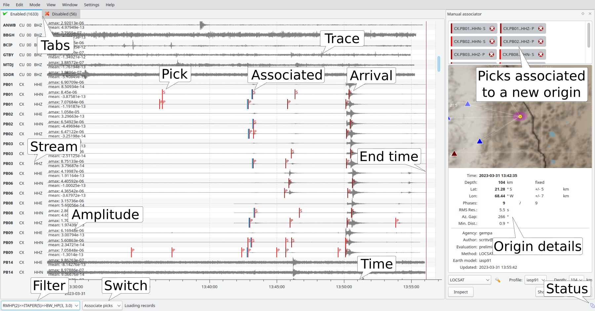

scrttv visualizes waveform data in miniSEED format
(see :ref:`Figure below <fig-scrttv-overview>`) in real-time or from archives
with a defined window length (default: 30 minutes) of defined streams/stations
(default: streams defined by global bindings). Additionally, phase picks are
visualized.

scrttv can be used for view waveforms,
:ref:`visual waveform quality control <scrttv-waveform-qc>` or
:ref:`interactive signal detection <scrttv-signal-detection>`.

When in :ref:`message mode <scrttv-modes>` scrttv dynamically resorts waveforms:
Normally, the trace order is given by configuration, e.g., ordering by epicentral
distance from a location given by :confval:`streams.sort.latitude` and
:confval:`streams.sort.longitude`.
In the event that a new SeisComP :term:`event` arrives from the messaging, the
traces are sorted  automatically by epicentral distance to the latest origin
received. In addition to waveforms, information about gaps or overlaps, picks
and the time of incoming origins are displayed.

.. _fig-scrttv-overview:

   scrttv overview

   An example of scrttv and the dialog window to associate picks to new origins.
   Tabs: Enable/Disable; Amplitude: mean and maximum;
   Stream: station, network, sensor location and channel code;
   Filter: filter applied traces; Status = connection status to messaging.

scrttv shows two tabs: the Enabled and the disabled tab
(see :ref:`fig-scrttv-overview`). Stations listed in the disabled tab
are excluded from automatic processing (e.g. phase picking). To move a station
from one tab to another just drag and drop the trace to the new tab. An alternative solution is
to double click on the trace label to disable a trace. Read the section
:ref:`scrttv-waveform-qc` for the details.

Normally, the raw data are displayed. Pressing :kbd:`f` the predefined bandpass filter
of third order from 0.5 Hz to 8 Hz, :ref:`BW(3,0.5,8) <filter-bw>` is applied
to the traces. Also zoom functions for the time and amplitude axis are provided.
Read the sections :ref:`<scrttv-filtering>` and  :ref:`scrttv-visualization` for
more details.

Among the configurable parameters are:

* Global :term:`bindings <binding>`:

  * default definition of traces to show (:confval:`detecStream` and :confval:`detecLocid`).

* :term:`Module <module>` configuration:

  * network, stations, locations and streams to show extending or overriding the
    default definition (:confval:`streams.codes`),
  * :ref:`data filters <scrttv-filtering>`,
  * buffer size controlling the length of loaded data (:confval:`bufferSize`),
  * sorting of traces upon arrival of new origins (:confval:`resortAutomatically`),
  * reference coordinate for sorting traces by default (:confval:`streams.sort.*`),
  * region filters (:confval:`streams.region.*`),
  * :ref:`grouping of streams <scrttv-grouping>` with different properties,
  * number of traces to show with fixed height (:confval:`streams.rows`).

* Scheme parameters in global :term:`module` configuration:

  * trace properties and trace background colors,
  * font and general GUI parameters.

More parameters are available on the command-line:

.. code-block:: sh

   scrttv -h

.. _scrttv-modes-operation:

Modes of Operation
==================

scrttv can be started in message mode or in offline mode.

* Message mode: scrttv is started normally and connects to the messaging,
  :term:`picks <picks>`, :term:`origins <origin>` and inventory are read from
  the database and received in real time from the messaging. Data are received
  from :term:`recordstream`.
* Offline mode: scrttv is started without connection to the messaging,
  :term:`picks <picks>` and :term:`origins <origin>` are not received in real
  time from the messaging. However, they can be loaded from XML files using the
  *File* menu. Data are received from :term:`recordstream` or from file. The
  offline mode is invoked when using the option :option:`--offline` or when
  passing a file name to scrttv at startup. Example:

  .. code-block:: sh

     scrttv file.mseed

.. _scrttv-visualization:

Waveform Visualization
======================

Stream selection
----------------

Without further configuration scrttv displays waveforms for streams defined
in global bindings. The selection can be refined by configuring
:confval:`streams.codes` and overridden on the command line using
:option:`--channels`.

Stream hiding
-------------

Streams with :ref:`data latency <scqc>` < :confval:`maxDelay` are hidden but
shown again when applicable. By default  :confval:`maxDelay` is unconfigured and
hiding streams is inactive. For listing
streams hidden from one tab press :kbd:`h`.

.. _scrttv-time-windows:

Time windows
------------

The reading waveforms from RecordStream, the data is displayed for a time
window which by default ends at current time or as given by the command-line
option :option:`--end-time`. Initially, the time window takes the length defined
in :confval:`bufferSize` or by the option :option:`--buffer-size`. When reading data
directly from file in offline mode, the time window is set
from the time limits of the waveforms.

* The **length of visible time windows** can be adjusted by
  :ref:`zooming <scrttv-zooming>`.
* The **end time of the data** progresses in continuously in real time (UTC)
  with the time of the computer clock unless fixed (:kbd:`F8`). The end time is
  fixed during startup when applying :option:`--end-time`.
* For **progressing or rewinding by 30 minutes** press :kbd:`Alt right` or
  :kbd:`Alt left`, respectively. Data will be loaded immediately.
* You may also **freely zoom** into any time window. Data and picks will be loaded
  when pressing :kbd:`Ctrl + r`
* **Return to default real-time processing** by pressing :kbd:`Ctrl + Shift + r`
  or :kbd:`N`.

.. hint::

   Gaps and overlaps in waveforms are indicated by yellow and purple areas,
   respectively. The colors are configurable.

.. _scrttv-zooming:

Zooming
-------

Waveforms can be zoomed in and out interactively in amplitude and time. Use the
*View* menu or refer to the section :ref:`scrttv-hot-keys` for options. In
addition to the actions available from the View menu, zooming is supported by
mouse actions:

* Zooming in in time: Right-click on time axis, drag to the right. A green bar appears
  which is the new time window. Dragging up or down (gray bar) disables zooming.
* Zooming out in time: Right-click on time axis, drag to the left. A red bar appears. The
  longer the bar, the more you zoom out.  Dragging up or down (gray bar)
  disables zooming.
* Zooming in time and amplitude: Mouse over a trace of interest, use
  :kbd:`Ctrl + mouse wheel` for zooming in or out.
* Zooming around a selected area: Press :kbd:`z` and drag an area with while
  pressing the left mouse button. Press :kbd:`z` again for leaving the zoom
  mode.

.. _scrttv-grouping:

Stream grouping
---------------

scrttv allows grouping of stations and even streams with different properties,
e.g. colors or color gradients.

.. _scrttv-fig-group-filter:

.. figure:: media/scrttv/groups.png
   :width: 16cm
   :align: center

   Stations with 2 groups and different line color gradients. Ungrouped stations
   are visible with default line properties. The applied filter
   is shown in the lower left corner. The tooltip on top of station CX.PB19
   is derived from :confval:`streams.group.$name.title`.

**Configuration**

Adjust the scrttv module configuration (:file:`scrttv.cfg`).

#. Define the groups:

   * add a new group profile to :confval:`streams.group`.
   * set the properties for this group profile. :term:`Colors <color>` and color
     gradients are defined by hexadecimal values or by
     :term:`color keyword name`.
     When choosing gradients the colors of the traces within one group will be
     varied in alphabetic order of the streams.
   * set a group title in :confval:`streams.group.$name.title`.

#. Register the groups in :confval:`streams.groups`.

**Viewing groups**

#. Open :program:`scrttv` to view the data.
#. Select *Sort by group* in the *Interaction* menu or use the hotkey :kbd:`5`
   to sort the traces by their groups.
#. Mouse over a station belonging to a group. The tooltips shows the group title.
#. For maintaining the sorting by groups adjust the :program:`scrttv` module
   configuration (:file:`scrttv.cfg`): ::

      resortAutomatically = false

.. _scrttv-picks:

Phase picks and arrivals
------------------------

Previous versions of scrttv (< 5.4) only displayed :term:`picks <pick>` with the
colors indicating the pick evaluation mode along with the phase hint of the
pick:

* red: automatic,
* green: manual.

This hasn't really changed in later versions but additionally scrttv determines
an additional state of a pick called :term:`arrival`. In scrttv a pick is
considered an arrival if it is associated to an valid origin. An origin is
called valid if its evaluation status is not REJECTED. When scrttv loads all
picks from the database for the currently visible time span it also checks if
each pick is associated with a valid origin and declares the arrival state if
the check yields true. The visibility of picks and arrivals can be toggled by
pressing :kbd:`Ctrl + p` and :kbd:`Ctrl + a`, respectively. :kbd:`c` removes all
markers. The configuration parameter :confval:`showPicks` controls the default
visibility.

Picks and arrivals can be differentiated visually by their colours. When
configured in global module configuration, the same colours are being used
consistently as in any other GUI displaying both types, namely

* :confval:`scheme.colors.picks.automatic`
* :confval:`scheme.colors.picks.manual`
* :confval:`scheme.colors.picks.undefined`
* :confval:`scheme.colors.arrivals.automatic`
* :confval:`scheme.colors.arrivals.manual`
* :confval:`scheme.colors.arrivals.undefined`

That visual difference should support the operator in finding clusters of picks
and creating new location missed by the automatic system.

The next sections will only use the :term:`pick` which can be used
interchangeable for pick or arrival.

.. _scrttv-record-borders:

Record borders
--------------

The borders of records are toggled by using the hotkey :kbd:`b`.

.. figure:: media/scrttv/borders.png
   :width: 16cm
   :align: center

   Record borders in box mode on top of waveforms.

Border properties can be adjusted and signed records can be visualized by colors
configured in the scheme parameters in :file:`global.cfg` or :file:`scrttv.cfg`:

* :confval:`scheme.records.borders.drawMode`: Define where to draw borders, e.g. on top, bottom or as boxes.
* :confval:`scheme.colors.records.borders.*`: Define pen and brush properties.

.. _scrttv-waveform-qc:

Waveform Quality Control
========================

Use scrttv for regular visual waveform inspection and for enabling or disabling
of stations. Disabled stations will not be used for automatic phase detections
and can be excluded from manual processing in :ref:`scolv`. They will also be
highlighted in :ref:`scmv` and :ref:`scqc`.

To enable or disable a station for automatic data processing in |scname| select
a station code with the mouse and drag the stations to the disable / enable tab
or simply double-click on the station code in the respective tab.

Stream Processing
=================

.. _scrttv-filtering:

Filtering
---------

scrttv allows filtering of waveforms. Any
:ref:`filter available in SeisComP <filter-grammar>` can be considered. The
filter selection dropdown menu (see :ref:`Figure above <fig-scrttv-overview>`)
and the hotkeys :kbd:`g` or :kbd:`d` can be used to toggle the list of filters.
This list of pre-defined in :confval:`filter` or in :confval:`filters`. You may
switch between filtere and unfiltered data by pressing :kbd:`f`. To show
filtered and raw data together use the hotkey :kbd:`r`.

.. note::

   The list of filters defined in :confval:`filters` overwrites :confval:`filter`.
   Activate :confval:`autoApplyFilter` to filter all traces at start-up of scrttv
   with the first filter defined in :confval:`filters`.

Gain correction
---------------

The stream gain is applied to waveforms and amplitude values are given in the
physical units defined in the inventory of the stream by default. For showing
amplitudes in counts, deactivate the option *Apply gain* in the Interaction menu.

.. _scrttv-signal-detection:

Interactive Signal Detection
============================

Beside visual inspection of waveforms for quality control, scrttv can also be
used for interactive signal detection in real time or for selected time windows
in the past.

.. _scrttv-artificial-origins:

Artificial origins
------------------

.. figure:: media/scrttv/artificial-origin.png
   :width: 16cm
   :align: center

   Artificial origin.

In case the operator recognizes several seismic signals which shall be processed
further, e.g. in :ref:`scolv`, an artificial/preliminary origin can be set by
either pressing the middle mouse
button on a trace or by opening the context menu (right mouse button) on a trace
and selecting "Create artificial origin". The following pop-up window shows the
coordinates of the selected station and the time the click was made on the
trace. The coordinates and time define the hypocenter parameters of the the new
artificial origin without adding any arrivals.
Pressing "Create" sends this origin to the LOCATION group. This artificial
origin is received e.g., by :ref:`scolv` and enables an immediate manual analysis
of the closest traces.

In order to send artificial origins and receive them in other GUIs
:confval:`commands.target` of the global module configuration must be configured
in line with :confval:`connection.username` of the receiving GUI module.

Alternatively, picks can be selected and preliminary origins can be created
which are sent to the system as regular origin objects, see section
:ref:`scrttv-origin-association`.

.. _scrttv-origin-association:

Pick association
----------------

scrttv comes with a minimal version of a phase associator and manual locator
based on selected and associated picks (Fig. :ref:`fig-scrttv-overview`). The
workflow is:

#. Visually identify phase picks which potentially belong to an event of interest,
#. :ref:`Select these picks <scrttv_pick-selection>` for automatic association,
#. :ref:`Control <scrttv_pick-locating>` the locator,
#. :ref:`Commit <scrttv_pick-commit>` created origins along with all associated
   picks.

Origins are committed to the messaging system as manual but preliminary location.
In contrast to the artificial origin operation which requires an immediate
intervention with, e.g. :ref:`scolv`, this operation allows to store all those
detected origins and work on them later because they will be stored in the
database.

.. note::

   More detailed waveform and event analysis can be made in :ref:`scolv`.

.. _scrttv_pick-selection:

Pick selection
~~~~~~~~~~~~~~

In order to select picks, the pick association mode must be entered. When done,
clicking with mouse onto the data and dragging a box (rubber band) around the
picks of interest will add the picks to a "cart".
"cart" refers to the list of selected picks which then available in the
associator/locator control widget used for locating an origin.

Simply dragging a new box will remove all previously selected picks. Further
keyboard-mouse options are:

* :kbd:`Shift + drag`: Add more picks to the while keeping the previous selection.
* :kbd:`Ctrl + drag`: Remove selected picks from the previous selection.

If at least one pick has been selected, the associator control will open as a
dock widget for locating based on the selected picks. There, individual picks
can also be removed from the selection by clicking on the close icon of each
pick item. Selected picks are also highlighted in the traces by a color
background bar.

.. note::

   A dock widget is a special kind of window which can be docked to any border
   of the application or even displayed floated as kind of overlay window. The
   position of the dock widget will be persistent across application restarts.

At any change of the pick set, the associator will attempt a relocation
displaying the results in the details. Error message will show up at the top.

.. _scrttv_pick-locating:

Locating from picks
~~~~~~~~~~~~~~~~~~~

The associator control exposes all locators available in the system presenting them
in a dropdown list at the bottom. The locator which should be selected as default
can be controlled with :confval:`associator.defaultLocator` and its default
profile by :confval:`associator.defaultLocatorProfile`.

Whenever the operator changes any of the values, a new location attempt is being
made which can succeed or fail. A successful attempt will update the details,
a failed attempt will reset the details and print an error message at the top
of the window.

Each locator can be configured locally by clicking the wrench icon. This
configuration is not persistent across application restarts. It can be used
to tune and test various settings. Global locator configurations in the
configuration files are of course being considered by scrttv.

In addition to the locator and its profile a fixed depth can be set. By default
the depth is free and it is up to the locator implementation to assign a depth
to the origin. The depth dropdown list allows to set a predefined depth. The
list of depth values can be controlled with :confval:`associator.fixedDepths`.

.. _scrttv_pick-commit:

Committing a solution
~~~~~~~~~~~~~~~~~~~~~

Once you accept a solution you may press the button "Commit" be for sending it
to the messaging as a regular origin. The receiving message group is defined by
:confval:`messaging.groups.location`. The new origin is then grabbed by all
connected modules, e.g., :ref:`scevent` and possibly associated to an
:term:`event`.

.. note::

   When considering non-default message groups such as in multi-pipeline systems,
   :confval:`messaging.groups.location` should be configuring accordingly.

Alternatively, the button "Show Details" can be used to just send the origin to
the GUI group and let :ref:`scolv` or other GUIs pick it up and show it. This
will not store the origin in the database and works the same way as creating
:ref:`artificial origins <scrttv-artificial-origins>`.

.. _scrttv-hot-keys:

Hotkeys
=======

=======================  =======================================
Hotkey                   Description
=======================  =======================================
:kbd:`F1`                Open |scname| documentation
:kbd:`Shift+F1`          Open scrttv documentation
:kbd:`F2`                Setup connection dialog
:kbd:`F11`               Toggle fullscreen
:kbd:`ESC`               Set standard selection mode and deselect all traces
:kbd:`c`                 Clear picker  markers
:kbd:`b`                 Toggle record borders
:kbd:`h`                 List hidden streams
:kbd:`Ctrl+a`            Toggle showing arrivals
:kbd:`Ctrl+p`            Toggle showing picks
:kbd:`n`                 Restore default display
:kbd:`o`                 Align by origin time
:kbd:`p`                 Enable pick selection mode
:kbd:`Alt+left`          Reverse the data time window by buffer size
:kbd:`Alt+right`         Advance the data time window by buffer size
-----------------------  ---------------------------------------
**Filtering**
-----------------------  ---------------------------------------
:kbd:`f`                 Toggle filtering
:kbd:`d`                 Switch to previous filter in list if filtering is enabled.
:kbd:`g`                 Switch to next filter in list if filtering is enabled.
:kbd:`r`                 Toggle showing all records
-----------------------  ---------------------------------------
**Navigation**
-----------------------  ---------------------------------------
:kbd:`Ctrl+f`            Search traces
:kbd:`up`                Line up
:kbd:`down`              Line down
:kbd:`PgUp`              Page up
:kbd:`PgDn`              Page down
:kbd:`Alt+PgUp`          To top
:kbd:`Alt+PgDn`          To bottom
:kbd:`left`              Scroll left
:kbd:`right`             Scroll right
:kbd:`Ctrl+left`         Align left
:kbd:`Ctrl+right`        Align right
-----------------------  ---------------------------------------
**Navigation and data**
-----------------------  ---------------------------------------
:kbd:`Alt+left`          Rewind time window by 30' and load data
:kbd:`Alt+right`         Progress time window by 30' and load data
:kbd:`Ctrl+r`            (Re)load data in current visible time range
:kbd:`Ctrl+Shift+r`      Switch to real-time with configured buffer size
-----------------------  ---------------------------------------
**Sorting**
-----------------------  ---------------------------------------
:kbd:`1`                 Restore configuration order of traces
:kbd:`2`                 Sort traces by distance
:kbd:`3`                 Sort traces by station code
:kbd:`4`                 Sort traces by network-station code
:kbd:`5`                 Sort traces by group
-----------------------  ---------------------------------------
**Zooming**
-----------------------  ---------------------------------------
:kbd:`<`                 Horizontal zoom-in
:kbd:`>`                 Horizontal zoom-out
:kbd:`y`                 Vertical zoom-out
:kbd:`Shift+y`           Vertical zoom-in
:kbd:`s`                 Toggle amplitude normalization
:kbd:`Ctrl+mouse wheel`  Vertical and horizontal zooming
:kbd:`z`                 Enable/disable zooming: Drag window with left mouse button
=======================  =======================================
