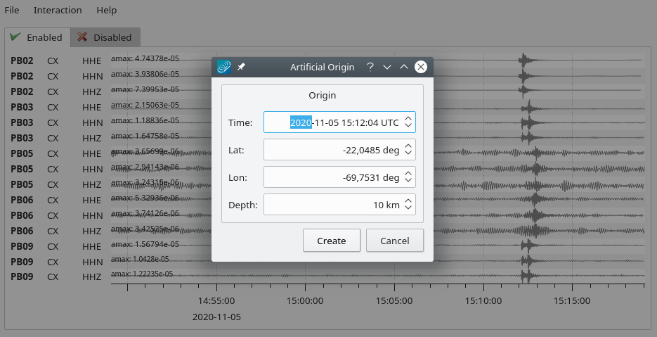
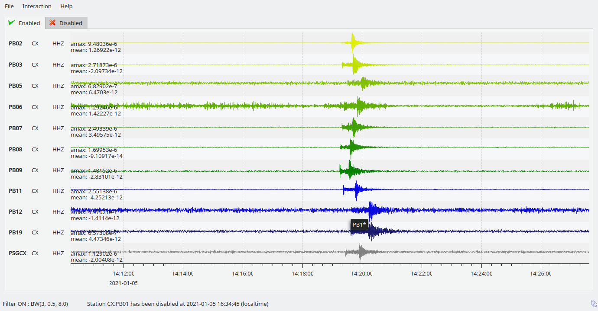
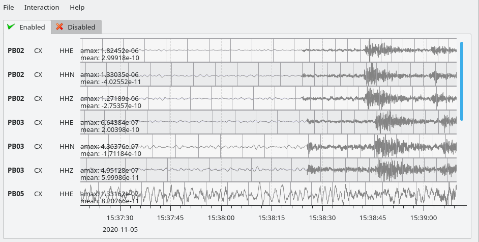

scrttv visualizes real-time waveform data (see :ref:`fig-scrttv-overview`) of
a defined window length (default=30 minutes) and of defined streams/stations
(default is primary station channels). scrttv switches between two modi.
In the normal mode the trace order is given by the configuration file.
In the event mode the traces are sorted by epicentral distance to the
latest origin received from the messaging. Additional to the waveform
traces information about gaps, picks and the time of incoming origins
are displayed.

.. _fig-scrttv-overview:

.. figure:: media/scrttv/overview.png
   :width: 16cm
   :align: center

   scrttv overview

   An example of scrttv and the dialog window to set preliminary origin.
   Tab 1-2 = enable/disable tab; Counts = maximum counts of a stream;
   Info = stream information (station, network and channel code);
   Filter = filter status of the traces; Status = connection status.

scrttv shows two tabs: the enabled and the disabled tab (see :ref:`fig-scrttv-overview`: Tab 1-2).
Stations listed in the disabled tab are excluded from processing (e.g. picking). To move a station
from one tab to another just drag and drop the trace to the new tab. An alternative solution is
to double click on the trace label to disable a trace.

Normally, the raw data are displayed. Pressing :kbd:`f` the predefined bandpass filter
of third order from 0.5 Hz to 8 Hz, :ref:`BW(3,0.5,8) <BW>` is applied to the traces.
Also zoom functions for the time and amplitude axis are provided.

   Artifical origin.

In case the operator recognizes several seismic signals, an artificial/preliminary origin can be set
by either pressing the middle mouse button on a trace or by opening the context menu (right mouse button)
on a trace and selecting "Create artificial origin". The following pop-up window shows the coordinates of the
station and the time the click was made on the trace. Both are used to generate
the new artificial origin without any arrivals. Pressing "Create" sends this origin to the
LOCATION group. This artificial origin is received e.g. by :ref:`scolv` and enables an immediate
manual analysis of the closest traces.

Among the configurable parameters are:

* Global :term:`bindings <binding>`:

  * default definition of traces to show (:confval:`detecStream` and :confval:`detecLocid`).

* :term:`Module <module>` configuration:

  * network, stations, locations and streams to show extending or overriding the default definition (:confval:`streams.codes`),
  * :ref:`data filters <scrttv-filtering>`,
  * buffer size controlling the lenght of loaded data (:confval:`bufferSize`),
  * sorting of traces upon arrival of new origins (:confval:`resortAutomatically`),
  * reference coordinate for sorting traces by default (:confval:`streams.sort.*`),
  * region filters (:confval:`streams.region.*`),
  * :ref:`grouping of streams <scrttv-grouping>` with different properties,
  * number of traces to show with fixed height (:confval:`streams.rows`).

* Scheme parameters in global :term:`module` configuration:

  * trace properties and trace background colors,
  * font and general GUI parameters.

More parameters are available on the command-line: ::

   scrttv -h

Enable / Disable Stations
=========================

To enable or disable a station for automatic data processing in |scname| select
a station code with the mouse and drag the
stations to the disable / enable tab or simply double-click on the station code.

.. _scrttv-filtering:

Stream Filtering
================

scrttv allows filtering of waveforms.
The hotkey :kbd:`f` can be used to
toggle the list of filters pre-defined in :confval:`filter` or in :confval:`filters`.
Note that the list of filters defined in :confval:`filters` overwrites :confval:`filter`.
Activate :confval:`autoApplyFilter` to filter all traces at start-up of scrttv
with the first filter defined in :confval:`filters`.
The applied filter is shown in the lower left corner (see :ref:`Figure below <scrttv-fig-group-filter>`).
To show filtered and raw data together use the hotkey :kbd:`r`.

.. _scrttv-grouping:

Stream Grouping
===============

scrttv allows grouping of stations and even streams with different properties, e.g. colors or color
gradients.

.. _scrttv-fig-group-filter:

   Stations with 2 groups and different line color gradients. Ungrouped stations
   are visible with default line properties. The applied filter
   is shown in the lower left corner. The tooltip on top of station CX.PB19
   is derived from :confval:`streams.group.$name.title`.

**Configuration**

Adjust the scrttv module configuration (:file:`scrttv.cfg`).

#. Define the groups:

   * add a new group profile to :confval:`streams.group`.
   * set the properties for this group profile. :term:`Colors <color>` and color gradients are
     defined by hexadecimal values or by :term:`color keyword names <color keyword name>`.
     When choosing gradients the colors of the traces within one group will be
     varied in alphabetic order of the streams.
   * set a group title in :confval:`streams.group.$name.title`.

#. Register the groups in :confval:`streams.groups`.

**Viewing groups**

#. Open :program:`scrttv` to view the data.
#. Select *Sort by group* in the *Interaction* menu or use the hotkey :kbd:`5`
   to sort the traces by their groups.
#. Mouse over a station belonging to a group. The tooltips shows the group title.
#. For maintaining the sorting by groups adjust the :program:`scrttv` module
   configuration (:file:`scrttv.cfg`): ::

      resortAutomatically = false

Record Borders
==============

The borders of records are toggled by using the hotkey :kbd:`b`.

   Record borders in box mode on top of waveforms.

Border properties can be adjusted and signed records can be visualized by colors
configured in the scheme parameters in :file:`global.cfg` or :file:`scrttv.cfg`:

* :confval:`scheme.records.borders.drawMode`: Define where to draw borders, e.g. on top, bottom or as boxes.
* :confval:`scheme.colors.records.borders.*`: Define pen and brush properties.

Offline Mode
============

To start scrttv without connection to the messaging use the option *--offline*
or simply provide the :term:`miniSEED` data file, e.g.: ::

   scrttv [your miniSEED file]

In offline mode event parameters given in :term:`SCML` files, e.g. from offline processing,
can be loaded using the *File* menu.

Hotkeys
=======

=======================  =======================================
Hotkey                   Description
=======================  =======================================
:kbd:`F1`                Open |scname| documentation
:kbd:`Shift+F1`          Open scrttv documentation
:kbd:`F2`                Setup connection dialog
:kbd:`F11`               Toggle fullscreen
:kbd:`c`                 Clear picker  markers
:kbd:`b`                 Toggle record borders
:kbd:`h`                 List hidden streams
:kbd:`n`                 Restore default display
:kbd:`o`                 Align by origin time
:kbd:`Alt+q`             Quit
-----------------------  ---------------------------------------
**Filtering**
-----------------------  ---------------------------------------
:kbd:`f`                 Toggle filter
:kbd:`r`                 Toggle all records
-----------------------  ---------------------------------------
**Navigation**
-----------------------  ---------------------------------------
:kbd:`Ctrl+f`            Search traces
:kbd:`up`                Line up
:kbd:`down`              Line down
:kbd:`PgUp`              Page up
:kbd:`PgDn`              Page down
:kbd:`Alt+PgUp`          To top
:kbd:`Alt+PgDn`          To bottom
:kbd:`left`              Scroll left
:kbd:`right`             Scroll right
:kbd:`Ctrl+left`         Align left
:kbd:`Ctrl+right`        Align right
-----------------------  ---------------------------------------
**Sorting**
-----------------------  ---------------------------------------
:kbd:`1`                 Restore configuration order of traces
:kbd:`2`                 Sort traces by distance
:kbd:`3`                 Sort traces by station code
:kbd:`4`                 Sort traces by network-station code
:kbd:`5`                 Sort traces by group
-----------------------  ---------------------------------------
**Zooming**
-----------------------  ---------------------------------------
:kbd:`<`                 Horizontal zoom-in
:kbd:`>`                 Horizontal zoom-out
:kbd:`y`                 Vertical zoom-out
:kbd:`Shift+y`           Vertical zoom-in
:kbd:`Ctrl+mouse wheel`  Vertical and horizontal zooming
:kbd:`z`                 Toggle zoom
=======================  =======================================
