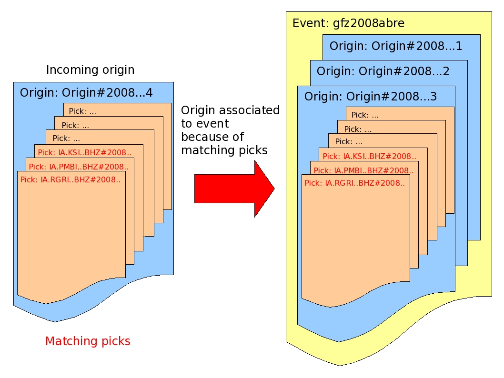
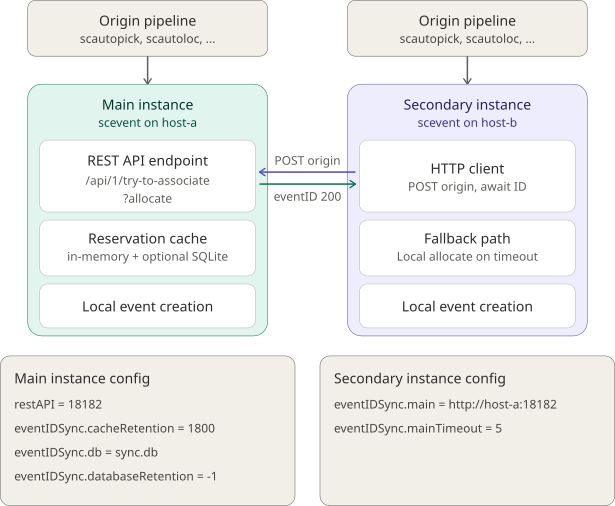

As a consequence of a real-time system the |scname| modules creates several
:term:`origins <origin>` (results of localization processes) for one earthquake
or other seismic events because as time
goes by more seismic phases are available. scevent receives these origins and
associates the origins to :term:`events <event>`. It is also possible to import
and associate origins from other agencies.

The main tasks of scevent are:

* :ref:`Create new events or associate origins <scevent-assocorg>` to existing events.
* Set the :ref:`ID of events <scevent-eventid>`.
* Set the :ref:`preferred origin <scevent-preforg>` from all available origins.
* Set the :ref:`preferred magnitude <scevent-prefmag>` from all available magnitudes.
* Set the :ref:`preferred focal mechanism <scevent-preffm>` from all available focal mechanisms.
* *Optional:* Set the event type of automatic origins by plugins:

  * :ref:`evrc <scevent_regioncheck>`: Type based on hypocenter,
  * :ref:`evtype <scevent_eventtype>`: Type based on comments added to picks,
    e.g., by :ref:`scautopick`.

.. _scevent-assocorg:

Origin Association
==================

scevent associates origins to event objects by searching for the best match of the new
(incoming) origin to other origins for existing events:

* Create new |scname| events for origins which cannot be associated to an
  existing event object and associate the origin to this new event.
* Associate origins to existing event objects: Origins belonging to **the same seismic
  event** shall be associated to the same event object.

Origins can be filtered/ignored based on

* ID of agency which has created the origin:
  :confval:`processing.blacklist.agencies`,
  :confval:`processing.whitelist.agencies` (global parameters),
* Hypocenter parameters: :confval:`eventAssociation.region.rect`,
  :confval:`eventAssociation.region.minDepth`,
  :confval:`eventAssociation.region.maxDepth`.

Origin match
------------

The new origin is matched to existing origins by comparing differences in epicenter,
origin time, and :term:`arrivals <arrival>` (associated picks).
The new origin is matched to an existing origin which has the highest rank in
the following three groups (1, 2, 3):

#. Location and Time (lowest)

   The difference in horizontal location is less than
   :confval:`eventAssociation.maximumDistance` (degrees)
   and the difference in origin times is less than
   :confval:`eventAssociation.maximumTimeSpan`.

#. Picks

   The two origins have more than :confval:`eventAssociation.minimumMatchingArrivals`
   matching picks. Picks are matched either by ID or by time depending
   on :confval:`eventAssociation.maximumMatchingArrivalTimeDiff`.

#. Picks and Location and Time (highest)

   This is the best match, for which both the location-and-time and picks
   criteria above are satisfied.

If more than one origin is found in the highest ranking class, then the first
one of them is chosen.

.. note::

   For efficiency events in the cache are scanned first and if no matches are found,
   the database is scanned for the time window :confval:`eventAssociation.eventTimeBefore` -
   :confval:`eventAssociation.eventTimeAfter`
   around the incoming Origin time. The cached events are ordered by eventID and
   thus in time.

No origin match
---------------

If no event with an origin that matches the incoming origin is found, then a
new event is formed and the origin is associated to that event. The following
criteria are applied to allow the creation of the new event:

* The agency for the origin is not black listed (:confval:`processing.blacklist.agencies`).
* The origin is automatic and it has more than :confval:`eventAssociation.minimumDefiningPhases`
  :term:`arrivals <arrival>` (associated picks).

    Association of an origin to an event by matching picks.

.. _scevent-preforg:

Preferred Origin
================

The preferred origin is set by ranking of all associated origins. The ranking
is controlled by :confval:`eventAssociation.priorities` and related configuration
parameters.

.. _scevent-prefmag:

Preferred Magnitude
===================

The preferred magnitude is set by ranking of the
:ref:`summary magnitude <scmag-summaryM>` and all :ref:`network magnitudes <scmag-networkM>`
of the preferred origin. The ranking is mainly controlled by
:confval:`eventAssociation.magTypes` and :confval:`eventAssociation.minimumMagnitudes`
and related configuration parameters.

Magnitudes where the evaluation mode is 'rejected' are ignored.

.. _scevent-preffm:

Preferred Focal Mechanism
=========================

The most recent manual focal mechanism or, if no manual ones are unavailable, the
most recent automatic focal mechnisms becomes preferred.

.. _scevent-eventid:

ID of Events
============

The ID of an event or eventID uniquely identifies an event. The ID is derived from
the time of occurrence of the event within a year. As configured by :confval:`eventIDPattern`
it typically consists of a prefix configured by :confval:`eventIDPrefix` and a
string containing the year and a set of characters or numbers defining the time.

.. _scevent-eventid-sync:

Distributed Event ID Allocation
===============================

When several :program:`scevent` instances process origins in parallel, each instance
independently sees origins arriving from its processing pipeline and would, without
coordination, pick its own event ID for the same earthquake. Event IDs are
derived from origin times with finite resolution of time slots. The length and the
number of available time slots are defined by :confval:`eventIDPattern` and
:confval:`eventIDLookupMargin`. Due to differences in configuration but also in
seismicity, two :program:`scevent` instances starting from the same origin time can
quickly diverge to different event IDs which shall be avoided by distributed allocation
of event IDs.

This concept affects two kinds of |scname| system deployments:

* **Redundant systems:** Two or more instances run *the same configuration* for high
  availability, and must agree on one event ID so that a failover is transparent to
  downstream consumers.
* **Distributed systems:** Instances run *different configurations* with different
  detection goals or focus (for example a global network alongside a dense regional
  network, or a fast automatic system alongside a more thorough one). The systems
  observe

  * the same earthquakes but with slightly different origin parameters due to their
    differences in configuration. Both systems should still assign a single, globally
    unique event ID to that earthquake rather than minting a separate ID on each system.
  * different earthquakes within the same time slot. Mutually unique IDs shall be given
    by the systems.

To achieve this, one instance is designated the **main** instance and the others act as
**secondary instances**. Each secondary instance asks the main instance, over the REST
API, which event ID to use for a new origin; the main instance either returns the ID of
an event it has already formed or reserves a fresh ID and keeps it cached for a
configurable amount of time. The main instance does not create an event for an incoming
secondary-instance request — it only reserves the ID. When the main instance's own
processing later sees a matching local origin, it picks up the cached ID and creates its
event with that same ID. The two instances therefore converge on the same event ID
without any explicit coordination between their messaging buses.

   Two :program:`scevent` instances synchronizing event IDs. The secondary instance
   posts each incoming origin to the main instance's
   ``/api/1/try-to-associate?allocate`` endpoint and uses the returned event ID for its
   local event creation.

If the main instance cannot be reached, or does not respond in time, the secondary
instance falls back to local event ID allocation. This preserves availability at the
cost of a possible (and recoverable) ID divergence during the outage.

The behavior is controlled by the parameters in the :confval:`eventIDSync` group:

* :confval:`eventIDSync.main` — URL of the main instance's REST API. Leave empty on the
  main instance (or on a standalone instance); set on each secondary instance.
* :confval:`eventIDSync.mainTimeout` — how long a secondary instance waits for the main
  instance's response before falling back to local allocation (default: 5 s).
* :confval:`eventIDSync.cacheRetention` — how long the main instance keeps a reserved ID
  and the associated foreign origin in its in-memory cache so that a matching local
  origin can reuse it (default: 1800 s).
* :confval:`eventIDSync.db` — optional path to an SQLite database file. When set, the
  main instance persists every reserved event ID (together with the origin time, origin
  public ID and the origin/picks as SCML) so that reservations survive a restart and can
  cover a much larger set than the in-memory cache. Leave empty to keep the
  in-memory-only behavior.
* :confval:`eventIDSync.databaseRetention` — how long persisted reservations are kept,
  by origin time. A negative value (the default) keeps them indefinitely; a positive
  value should be at least as large as :confval:`eventIDSync.cacheRetention`.

When :confval:`eventIDSync.db` is set, a try-to-associate request that does not match an
in-memory reservation additionally consults the database. The lookup first tries a
direct match on the incoming origin's public ID (a fast path that immediately reuses the
stored event ID), and otherwise loads all stored origins whose time lies between
:confval:`eventAssociation.eventTimeBefore` before and
:confval:`eventAssociation.eventTimeAfter` after the incoming origin time and compares
them by epicenter and shared picks — the same strategy scevent uses against the SeisComP
database.

The matching criteria used to decide whether a local origin "is" the same earthquake as
a cached foreign origin are the same as those used for ordinary event association:
origin time difference within :confval:`eventAssociation.maximumTimeSpan`, epicenter
distance within :confval:`eventAssociation.maximumDistance` and, if pick information is
available on both sides, at least :confval:`eventAssociation.minimumMatchingArrivals`
matching picks.

Roles and configuration
-----------------------

==============  ========================================================================
Role            Configuration
==============  ========================================================================
**Standalone**  :confval:`eventIDSync.main` empty, :confval:`restAPI` unset. Local ID
                allocation only. This is the historical behavior and the default.
**Main**        :confval:`eventIDSync.main` empty, :confval:`restAPI` set. Allocates IDs
                locally and additionally serves ``/api/1/try-to-associate?allocate``
                and ``/api/1/allocate`` requests from secondary instances. Read also
                section :ref:`scevent-restapi`.
**Secondary**   :confval:`eventIDSync.main` set to the main instance's REST URL.
                Queries the main instance for each new event and falls back to local
                allocation on failure. Read also section :ref:`scevent-restapi`.
==============  ========================================================================

Example deployment
------------------

For a two-host redundant deployment with hosts ``host-a`` (running the main instance)
and ``host-b`` (running a secondary instance):

On the main instance:

.. code-block:: properties

   # /etc/seiscomp/scevent.cfg on 'host-a'
   restAPI = 18182
   eventIDSync.cacheRetention = 1800

On the secondary instance:

.. code-block:: properties

   # /etc/seiscomp/scevent.cfg on 'host-b'
   eventIDSync.main = http://host-a:18182
   eventIDSync.mainTimeout = 5

At startup each instance logs its role; for example, the secondary
instance prints:

.. code-block:: none

   eventID synchronization: secondary mode, main=http://host-a:18182, main timeout=5s

and the main instance prints:

.. code-block:: none

   eventID synchronization: main mode (allocations cached for 1800s)

.. _scevent-journals:

Journals
========

scevent can be commanded by journals to do a certain action. Journal entries are being
received via the messaging bus to any of the subscribed groups. A journal entry
contains an action, a subject (a publicID of an object) and optional parameters.
Journals can be interactively sent to the messaging by :ref:`scsendjournal`.

If scevent has handled an action, it will send a reply journal entry with
an action formed from the origin action name plus **OK** or **Failed**. The
parameters of the journal entry contain a possible reason.

The following actions are supported by scevent:

.. function:: EvGrabOrg(objectID, parameters)

   Grabs an origin and associates it to the given event. If the origin is
   already associated with another event then its reference to this event
   will be removed.

   :param objectID: The ID of an existing event
   :param parameters: The ID of the origin to be grabbed

.. function:: EvMerge(objectID, parameters)

   Merges an event (source) into another event (target). After successful
   completion the source event will be deleted.

   :param objectID: The ID of an existing event (target)
   :param parameters: The ID of an existing event (source)

.. function:: EvName(objectID, parameters)

   Adds or updates the event description with type "earthquake name".

   :param objectID: The ID of an existing event
   :param parameters: An event name

.. function:: EvNewEvent(objectID, parameters)

   Creates a new event based on a given origin. The origin must not yet be
   associated with another event.

   On a secondary instance (:confval:`eventIDSync.main` set) the event ID for
   the new event is obtained from the main instance through its
   :ref:`/api/1/allocate <scevent-restapi-allocate>` endpoint, so that main and
   secondary instances stay synchronized; on failure the secondary falls back to
   local allocation.

   :param objectID: The origin publicID of the origin which will be used to
                    create the new event.
   :param parameters: Unused

.. function:: EvOpComment(objectID, parameters)

   Adds or updates the event comment text with id "Operator".

   :param objectID: The ID of an existing event
   :param parameters: The comment text

.. function:: EvPrefFocMecID(objectID, parameters)

   Sets the preferred focal mechanism ID of an event. If a focal mechanism ID
   is passed then it will be fixed as preferred solution for this event and
   any subsequent focal mechanism associations will not cause a change of the
   preferred focal mechanism.

   If an empty focal mechanism ID is passed then this is considered as "unfix"
   and scevent will switch back to automatic preferred selection mode.

   :param objectID: The ID of an existing event
   :param parameters: The focal mechanism ID which will become preferred or empty.

.. function:: EvPrefMagType(objectID, parameters)

   Set the preferred magnitude of the event matching the requested magnitude
   type.

   :param objectID: The ID of an existing event
   :param parameters: The desired preferred magnitude type

.. function:: EvPrefMw(objectID, parameters)

   Sets the moment magnitude (Mw) of the preferred focal mechanism as
   preferred magnitude of the event.

   :param objectID: The ID of an existing event
   :param parameters: Boolean flag, either "true" or "false"

.. function:: EvPrefOrgAutomatic(objectID, parameters)

   Releases the fixed origin constraint. This call is equal to :code:`EvPrefOrgID(eventID, '')`.

   :param objectID: The ID of an existing event
   :param parameters: Unused

.. function:: EvPrefOrgEvalMode(objectID, parameters)

   Sets the preferred origin based on an evaluation mode. The configured
   priorities are still valid. If an empty evaluation mode is passed then
   scevent releases this constraint.

   :param objectID: The ID of an existing event
   :param parameters: The evaluation mode ("automatic", "manual") or empty

.. function:: EvPrefOrgID(objectID, parameters)

   Sets the preferred origin ID of an event. If an origin ID is passed then
   it will be fixed as preferred solution for this event and any subsequent
   origin associations will not cause a change of the preferred origin.

   If an empty origin ID is passed then this is considered as "unfix" and
   scevent will switch back to automatic preferred selection mode.

   :param objectID: The ID of an existing event
   :param parameters: The origin ID which will become preferred or empty.

.. function:: EvRefresh(objectID, parameters)

   Refreshes the event information. This operation can be useful if the
   configured fep region files have changed on disc and scevent should
   update the region information. Changed plugin parameters can be another
   reason to refresh the event status.

   :param objectID: The ID of an existing event
   :param parameters: Unused

.. function:: EvSplitOrg(objectID, parameters)

   Remove an origin reference from an event and create a new event for
   this origin.

   On a secondary instance (:confval:`eventIDSync.main` set) the event ID for
   the new event is obtained from the main instance through its
   :ref:`/api/1/allocate <scevent-restapi-allocate>` endpoint, so that main and
   secondary instances stay synchronized; on failure the secondary falls back to
   local allocation.

   :param objectID: The ID of an existing event holding a reference to the
                    given origin ID.
   :param parameters: The ID of the origin to be split

.. function:: EvType(objectID, parameters)

   Sets the event type to the passed value.

   :param objectID: The ID of an existing event
   :param parameters: The event type

.. function:: EvTypeCertainty(objectID, parameters)

   Sets the event type certainty to the passed value.

   :param objectID: The ID of an existing event
   :param parameters: The event type certainty

.. _scevent-restapi:

REST API
========

For generating unique event IDs across multiple |scname| systems (read section
:ref:`scevent-eventid-sync`) :program:`scevent` provides a HTTP REST API which may be
enabled by defining a bind address under :confval:`restAPI`. The available endpoints are
listed below.

.. _scevent-restapi-associate:

try-to-associate
----------------

Query the ID of the event a provided origin can be associated to. An event ID is
returned if a matching event is found. By default no event is ever created and no event
ID is allocated. When the optional query parameter ``allocate`` is given and no existing
event matches the supplied origin, the receiving :program:`scevent` instance reserves a
new event ID on behalf of the caller; this mode is used internally by secondary
instances to obtain an event ID from a main instance.

==================  ===================================================================
Request/Response    Description
==================  ===================================================================
**Location**        ``/api/1/try-to-associate`` (lookup only) or
                    ``/api/1/try-to-associate?allocate`` (lookup and reserve if no
                    match)
**HTTP Methods**    POST
**Request data**    :term:`SCML` containing an :ref:`EventParameters
                    <api-python-datamodel-eventparameters>` element with one and only
                    one :ref:`Origin <api-python-datamodel-origin>`. :ref:`Pick
                    <api-python-datamodel-pick>` objects associated with the origin's
                    arrivals may be included so that the receiver can match by pick IDs
                    in addition to time and location.
**Request header**  ``Content-Type: text/xml`` (no subtype allowed)
**Response data**   Event ID string
**Response code**   **200** (matching event found or new event ID reserved in
                    ``allocate`` mode), **204** (no matching event found and no
                    reservation made), **400** (invalid input)
==================  ===================================================================

The following example demonstrates how to query the event ID for an origin defined in
:file:`origin.xml` using the command-line program :program:`curl`. The request header
``Content-Type`` must be specified. It is assumed that :program:`scevent` is configured
with ``restAPI = 18182``.

.. code-block:: sh

   curl -v -X POST http://localhost:18182/api/1/try-to-associate -H "Content-Type: text/xml" -d @origin.xml

To additionally let the receiver reserve a new event ID when no existing event matches
the supplied origin, append the ``allocate`` query parameter:

.. code-block:: sh

   curl -v -X POST "http://localhost:18182/api/1/try-to-associate?allocate" -H "Content-Type: text/xml" -d @origin.xml

In ``allocate`` mode the reserved ID is cached together with the supplied origin for
:confval:`eventIDSync.cacheRetention` seconds (and, if :confval:`eventIDSync.db` is set,
also stored in the persistent database for :confval:`eventIDSync.databaseRetention`
seconds, or indefinitely when that is negative). A local origin processed by the
receiving instance which matches the cached or stored foreign origin (same time,
distance and optionally matching pick IDs) will then reuse the reserved ID instead of
allocating a new one, ensuring that the main instance and the secondary instance
converge on the same event ID for the same earthquake.

.. _scevent-restapi-allocate:

allocate
--------

Reserve a brand-new, distinct event ID for a provided origin. Unlike
:ref:`try-to-associate <scevent-restapi-associate>`, this endpoint never matches the
origin against existing events: it always allocates and reserves a fresh event ID, even
when the origin would match an event that already exists. It is used internally by a
secondary instance when it must form a *separate* event for an origin that is already
associated elsewhere — the :func:`EvSplitOrg` (split an origin into its own event) and
:func:`EvNewEvent` (force a new event) journal commands. In those cases querying
``try-to-associate`` would return the ID of the very event the origin already belongs
to, which is not what a split or forced new event needs.

==================  ===================================================================
Request/Response    Description
==================  ===================================================================
**Location**        ``/api/1/allocate``
**HTTP Methods**    POST
**Request data**    :term:`SCML` containing an :ref:`EventParameters
                    <api-python-datamodel-eventparameters>` element with one and only
                    one :ref:`Origin <api-python-datamodel-origin>`. :ref:`Pick
                    <api-python-datamodel-pick>` objects associated with the origin's
                    arrivals may be included so that the receiver can match by pick IDs
                    in addition to time and location.
**Request header**  ``Content-Type: text/xml`` (no subtype allowed)
**Response data**   Event ID string
**Response code**   **200** (new event ID reserved), **204** (no event ID could be
                    allocated), **400** (invalid input)
==================  ===================================================================

The following example reserves a new event ID for an origin defined in
:file:`origin.xml`. It is assumed that :program:`scevent` is configured with
``restAPI = 18182``.

.. code-block:: sh

   curl -v -X POST http://localhost:18182/api/1/allocate -H "Content-Type: text/xml" -d @origin.xml

The reserved ID is cached (and, if :confval:`eventIDSync.db` is set, persisted) exactly
as in the ``allocate`` mode of :ref:`try-to-associate <scevent-restapi-associate>`, so a
repeated request for the same origin returns the same reserved ID rather than allocating
a second one.
