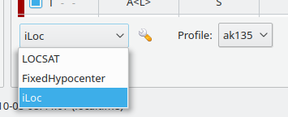
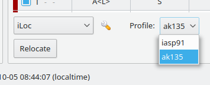
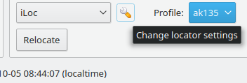
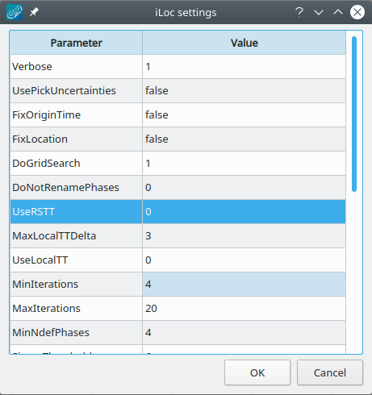
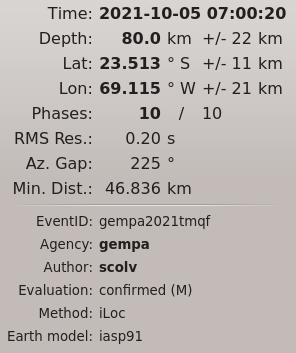

iLoc is a locator developed by István Bondár integrated into |scname|
by `gempa GmbH`_. It is invoked by the wrapper plugin *lociloc* which is the
interface between |scname| and iLoc.

Background
==========

iLoc is a locator tool for locating seismic, hydroacoustic and infrasound sources
based on :term:`phase picks <pick>`. iLoc is based on the location algorithm developed
by :ref:`Bondár and McLaughlin, 2009 <sec-iloc-references>` and implemented at the
International Seismological Center, `ISC`_ :ref:`Bondár and Storchak, 2011 <sec-iloc-references>`
with numerous new features added :ref:`Bondár et al., 2018 <sec-iloc-references>`.
The stand-alone iLoc code can be downloaded from the `IRIS SeisCode`_ software repository.

Among the major advantages of using iLoc is that it can

* Use any phases with valid travel-time predictions;
* Use seismic, hydroacoustic and infrasound arrival time, slowness and azimuth
  observations in location;
* Use travel-time predictions from a global 3D upper mantle velocity model;
* Use a local 1D velocity model;
* Account for the correlated travel-time prediction error structure due to
  unmodeled 3D velocity heterogeneities;
* Check if the data has sufficient resolution to determine the hypocenter depth;
* Identify ground truth (GT5) candidate events.

iLoc History
============

* Originally developed for U.S. Air Force Research Laboratory, today the standard
  at the International Seismological Centre (ISC) replacing previous routines
* Open source, download website: https://seiscode.iris.washington.edu/projects/iloc
* Integrated first in SeisComP3 in 2019
* Basis of the EMSC crowd-source locator, CsLoc since 2019
* EMSC standard as of 2022

iLoc in a Nutshell
==================

* Accounts for correlated travel-time prediction errors
* Initial hypocenter guess from Neighbourhood Algorithm search
* Linearised inversion using a priori estimate of the full data covariance matrix
  Attempts for free-depth solution only if there is depth resolution
* Default depth is derived from historical seismicity
* Seismic, hydroacoustic and infrasound observations
* Arrival time, slowness and azimuth measurements
* Uses most ak135 or iasp91 Earth model phases in locating
* Integrated RSTT travel-time predictions
* RSTT is default for Pn/Sn and Pg/Lg
* Local velocity model and local phase TT predictions for Pg/Sg/Lg, Pb/Sb, Pn/Sn.

iLoc Algorithms
===============

This section describes some of the principles. The full description of the applied
algorithms can be found in the iLoc documentation provided along with the package
on the `IRIS SeisCode`_ website.

Neighbourhood algorithm
-----------------------

Linearized inversion algorithms are quite sensitive to the initial guess. In order
to find an initial hypocentre guess for the linearized inversion the Neigbourhood
Algorithm :ref:`Sambridge, 1999; Sambridge and Kennett, 2001;
Kennett, 2006 <sec-iloc-references>` is performed around the starting hypocentre
if :confval:`iLoc.profile.$name.DoGridSearch` is active.

During the NA search, we identify the phases with respect to each trial hypocentre
and calculate the misfit of the trial hypocentre. The misfit is defined as the sum
of the :confval:`iLoc.profile.$name.NAlpNorm` residual and a penalty factor that
penalizes against freakish local minima provided by just a few phases. In the first
iteration :confval:`iLoc.profile.$name.NAinitialSample` hypocenter hypotheses are tested,
while the subsequent iterations consider the best :confval:`iLoc.profile.$name.NAcells`
solutions and resample the search space around them with
:confval:`iLoc.profile.$name.NAnextSample` hypocenter hypotheses. The solution with
the lowest misfit after :confval:`iLoc.profile.$name.NAiterMax` iteration is taken
as the initial hypocenter for the linearized least squares inversion.

A grid search can be performed to obtain a better initial hypocenter
guess. The search is performed around the starting hypocenter.
For a very exhaustive search one can increase :confval:`iLoc.profile.$name.NAinitialSample`,
:confval:`iLoc.profile.$name.NAnextSample` and :confval:`iLoc.profile.$name.NAcells`
values. Note that the maximum value for :confval:`iLoc.profile.$name.NAinitialSample`
is around 3500 before hitting memory limits.

An exhaustive search will
considerably slow iLoc down, especially when RSTT predictions are
enabled (:confval:`iLoc.profile.$name.UseRSTT`, :confval:`iLoc.profile.$name.UseRSTTPnSn`,
:confval:`iLoc.profile.$name.UseRSTTPgLg`).

Depth resolution
----------------

Depth resolution can be provided by a local network, depth phases, core reflections
and to a lesser extent near-regional secondary phases. iLoc attempts for a free-depth
solution if the set of :term:arrivals meets at least one of the following conditions:

* Number of pairs of defining P and depth phases :math:`\le` :confval:`iLoc.profile.$name.MinDepthPhases`
* Number of pairs of defining P and core phases :math:`\le` :confval:`iLoc.profile.$name.MinCorePhases`
* Number of pairs of defining P and S phases :math:`\le` :confval:`iLoc.profile.$name.MinSPpairs`
  within a regional distance of :confval:`iLoc.profile.$name.MaxLocalDistDeg` degree
* Number of defining P phases :math:`\le` :confval:`iLoc.profile.$name.MinLocalStations`
  within a local distance of :confval:`iLoc.profile.$name.MinLocalStations` degree.

If there is insufficient depth resolution provided by the data, or the depth uncertainty
for a free-depth solution exceeds a threshold, the hypocentre depth is set to the depth
from the default depth grid if a grid point for the epicentre location exists; otherwise
it is set to a depth :ref:`Bolton et al., 2006 <sec-iloc-references>` assigned to
the corresponding Flinn-Engdahl :ref:`Young et al., 1996 <sec-iloc-references>` geographic
region. The default depth grid :ref:`Bondár and Storchak, 2011 <sec-iloc-references>`
is defined on a 0.5º x 0.5º grid as the median of all depths in the cell, provided
that there were at least five events in the cell, and the 75–25 percent quartile
range was less than 100 km. The latter constraint is imposed to avoid regions with
both shallow and deep seismicity. Anthropogenic events are fixed to the surface.
Finally, the user can fix the depth to the initial depth.

iLoc reports back how the depth was determined in the FixedDepthType parameter:

* 0 - free depth solution
* 1 - airquake/deepquake, depth fixed to surface/MaxHypocenterDepth
* 2 - depth fixed to depth reported by an agency (not used in |scname|)
* 3 - depth fixed to depth-phase depth
* 4 - anthropogenic event, depth fixed to surface
* 5 - depth fixed to default depth grid depth
* 6 - no default depth grid point exists, fixed to median reported depth
* 7 - no default depth grid point exists, fixed to GRN-dependent depth
* 8 - depth fixed by user provided value

Linearized inversion
--------------------

Once the Neighbourhood search get close to the global optimum, iloc switches
to an iterative linearized least-squares inversion of travel-time, azimuth and
slowness observations :ref:`Bondár and McLaughlin, 2009;
Bondár and Storchak, 2011 <sec-iloc-references>` to obtain the final solution
for the hypocenter.

The :ref:`Paige and Saunders, 1982 <sec-iloc-references>` convergence test is
applied after every iteration. Once a convergent solution is obtained, the location
uncertainty is defined by the a posteriori model covariance matrix. The model
covariance matrix yields the four-dimensional error ellipsoid whose projections
provide the two-dimensional error ellipse and one-dimensional errors for depth
and origin time. These uncertainties are scaled to the 90% confidence level
:ref:`Jordan and Sverdrup, 1981 <sec-iloc-references>`.

The final hypocentre is tested against the :ref:`Bondár and McLaughlin, 2009 <sec-iloc-references>`
ground truth selection criteria, and it is reported as a GT5candidate if the solution
meets the GT5 criteria.

Some important parameters are:

* :confval:`iLoc.profile.$name.SigmaThreshold`: Residuals that exceed
  :math:`abs(Sigmathreshold * PriorMeasError)` are made non-defining.
* :confval:`iLoc.profile.$name.MinNdefPhases`: Minimum number of observations
  required to attempt for a solution.

If the number of defining arrival times exceed :confval:`iLoc.profile.$name.MinNdefPhases`,
then slowness observations will not be used in the location.

Integration into |scname|
=========================

* Integration of iLoc into |scname| is provided by a library of routines.
* |scname| modules call iLoc routines by passing the objects via the plugin *lociloc*
  installed in :file:`@DATADIR@/plugins/lociloc.so`.
* iLoc returns objects to |scname| for integration.
* The iLoc implementation in |scname| retains all original iLoc functionalities.

Velocity Models
===============

iLoc ships with the global models *iasp91* and *ak135* as well as with regional
seismic travel-time tables, RSTT, which, if activated by configuration, replaces
the global models in areas where they are defined.

.. _iloc-velocity_global:

Global models
-------------

The global models *iasp91* and *ak135* and RSTT are available by default without
further configuration.

.. _iloc-velocity_rstt:

RSTT
----

RSTT are available in :file:`@DATADIR@/iloc/RSTTmodels/pdu202009Du.geotess`.
Custom RSTT can be integrated into iLoc and provided to |scname|.
For adding custom RSTT to iLoc read the original iLoc documentation from the
`IRIS SeisCode`_ software repository.

The usage of RSTT is controlled per iLoc profile by global configuration
parameters

* :confval:`iLoc.profile.$name.UseRSTT`
* :confval:`iLoc.profile.$name.UseRSTTPnSn`
* :confval:`iLoc.profile.$name.UseRSTTPgLg`

.. _iloc-velocity_local:

Local velocity models
----------------------

Custom local velocity models can be provided by a file in
:file:`@DATADIR@/iloc/localmodels`. Example file
:file:`@DATADIR@/iloc/localmodels/test.localmodel.dat`: ::

   #
   # test
   #
   # number of layers
   4
        0.000    5.8000    3.4600 x
       20.000    6.5000    3.8500 CONRAD
       45.000    8.0400    4.4800 MOHO
       77.500    8.0400    4.4800 x

Once added, the velocity can be configured in |scname| as set out in section
:ref:`iloc-setup`.

Elevation Correction
====================

iLoc considers station elevation. It calculates the elevation correction,
*elevationCorrection*, for a station as

.. math::

   elevationCorrection = \frac{\sqrt{1 - (surfVel * p)^2} * elev}{surfVel}

where

* *elev*: elevation of the station
* *p*: the ray parameter (horizontal slowness)
* *surfVel*: layer P or S velocity of at the surface depending on the last lag
  of the phase name.

.. note ::

   iLoc does not allow airquakes or source locations above datum (0 km). If the
   depth of an origin becomes negative, iLoc
   fixes the depth to 0 km and the depth type of the origin will be "operator assigned".

.. _iloc-setup:

Setup
=====

#. Add the plugin *lociloc* to the global configuration, e.g. in
   :file:`@SYSTEMCONFIGDIR@/global.cfg`: ::

      plugins = ${plugins}, lociloc

#. Download iLoc from the iLoc website, extract the travel-time tables and model files.
   Then, install the required files and directories in :file:`@DATADIR@/iloc`, e.g.: ::

      mkdir $SEISCOMP_ROOT/share/iloc
      wget -O /tmp/iLocAuxDir.tgz "http://iloc.geochem.hu/data/iLocAuxDir.tgz"
      tar xvf /tmp/iLocAuxDir.tgz -C /tmp/
      cp -r /tmp/iLocAuxDir $SEISCOMP_ROOT/share/iloc/auxdata

   .. note ::

      * Check https://seiscode.iris.washington.edu/projects/iloc for updates before
        downloading
      * Instead of copying the :file:`auxdata` directory, you can also create a
        symbolic link and maintain always the same iLoc versin in |scname| and
        externally.

#. Add and configure iLoc profiles for the velocity models. The global models *iasp91*
   and *ak135* are considered by default with default configuration parameters.
   Create new profiles in oder to adjust their configuration parameters:

   * :confval:`iLoc.profile.$name.globalModel`: The name of the
     :ref:`global model <iloc-velocity_global>`, e.g. *iasp91* or *ak135*.
   * Consider the :ref:`RSTT parameters <iloc-velocity_rstt>`.
   * :confval:`iLoc.profile.$name.LocalVmodel`: The name of the file containing
     the :ref:`local velocity model <iloc-velocity_local>`.
   * :confval:`iLoc.profile.$name.DoNotRenamePhases`: Renaming seismic phases automatically
     impacts the usability of the origins with other locators and locator profiles.
     Activate the parameter to avoid phase renaming.
   * Consider the remaining parameters.

   .. note ::

      Creating the profiles allows using the same global velocity model along
      with different local models or RSTT settings in separate profiles.

#. Test the locator using :ref:`scolv` or configure with :ref:`screloc` or other
   locator modules.

Interactive Usage
=================

Once the *lociloc* plugin is configured, the iLoc locator can be selected in
:ref:`scolv`:

   Select iLoc locator

along with a profile:

   Select iLoc profile

The settings for iLoc can be adjusted by pressing the wrench button next to the
locator selection combo box

   Start the settings dialog

which opens the iLoc settings dialog:

   Adjust the settings and click OK to confirm

.. warning ::

   By default, automatic phase renaming by iLoc is active. The renaming may change
   the phase names, e.g. from P to Pn.

   Renaming seismic phases automatically will later impact the usability of
   the new origins with other locators and locator
   profiles. Deactivate DoNotRenamePhases to avoid phase renaming.

   However,
   when deactivating, iLoc may not provide results if the initial phases do not
   exist in the phase table for the given source depth and epicentral distance.
   Example: For great source depth and small epicentral distance, the first arrival
   phase is p or Pn and not P but |scname| provides P.

After relocating, the iLoc locator and the selected profile are shown in the scolv
Location tab as Method and Earth model, respectively:

   Information in scolv Locator tab

.. _sec-iloc-references:

References
==========

.. target-notes::

.. _`gempa GmbH`: https://www.gempa.de
.. _`ISC`: http://www.isc.ac.uk
.. _`IRIS SeisCode`: https://seiscode.iris.washington.edu/projects/iloc

#. Bolton, M.K., D.A. Storchak, and J. Harris, 2006, Updating default depth in the
   ISC bulletin, Phys. Earth Planet. Int., 158, 27-45.
#. Bondár, I., K. McLaughlin and H. Israelsson, Improved event location uncertainty
   estimates, Science Applications International Corp., Final Report, AFRL-RV-HA-TR-2008-1074, 2008.
#. Bondár, I. and K. McLaughlin, Seismic location bias and uncertainty in the presence
   of correlated and non-Gaussian travel-time errors, Bull. Seism. Soc. Am., 99, 172-193, DOI:10.1785/0120080922, 2009.
#. Bondár, I. and K. McLaughlin, 2009, A new ground truth data set for seismic studies,
   Seism. Res. Let., 80, 465-472.
#. Bondár, I., and D. Storchak, Improved location procedures at the International
   Seismological Centre, Geophys. J. Int., 186, 1220-1244, DOI:10.1111/j.1365-246X.2011.05107.x, 2011.
#. Bondár, I., E.R. Engdahl, A. Villasenor, J.Harris and D. Storchak, ISC-GEM:
   Global instrumental earthquake catalogue (1900-2009), II. Location and seismicity
   patterns, Phys. Earth. Planet. Int., DOI: 10.1016/j.pepi.2014.06.002, 239, 2-13, 2015.
#. Bondár, I., P. Mónus, Cs. Czanik, M. Kiszely, Z. Gráczer, Z. Wéber, and the
   AlpArrayWorking Group, Relocation of Seismicity in the Pannonian Basin Using a
   Global 3D Velocity Model, Seism. Res. Let., 89, 2284-2293, DOI:10.1785/0220180143, 2018.
#. Buland, R. and C.H. Chapman, 1983. The computation of seismic travel times,
   Bull. Seism. Soc. Am., 73, 1271-1302.
#. Dziewonski, A.M. and F. Gilbert, 1976, The effect of small, aspherical perturbations
   on travel times and a re-examination of the correction for ellipticity,
   Geophys., J. R. Astr. Soc., 44, 7-17.
#. Engdahl, E.R., R. van der Hilst, and R. Buland, 1998. Global teleseismic earthquake
   relocation with improved travel times and procedures for depth determination,
   Bull. Seism. Soc. Am., 88, 722-743.
#. Jordan T.H. and K.A. Sverdrup, 1981, Teleseismic location techniques and their
   application to earthquake clusters in the South-Central Pacific, Bull. Seism.
   Soc. Am., 71, 1105-1130.
#. Kennett, B. and Engdahl, E.R., 1991. Travel times for global earthquake location
   and phase identification, Geophys. J. Int., 105, 429–465.
#. Kennett, B.L.N., E.R. Engdahl, and R. Buland,  1995. Constraints on seismic velocities
   in the Earth from traveltimes, Geophys. J. Int., 122, 108-124.
#. Kennett, B.L.N. and O. Gudmundsson, 1996, Ellipticity corrections for seismic phases,
   Geophys. J. Int., 127, 40-48.
#. Myers, S.C, M.L. Begnaud, S. Ballard, M.E. Pasyanos, W.S. Phillips, A.L. Ramirez,
   M.S. Antolik, K.D. Hutchenson, J. Dwyer, C. A. Rowe, and G. S. Wagner, 2010,
   A crust and upper mantle model of Eurasia and North Africa for Pn travel time calculation,
   Bull. Seism. Soc. Am., 100, 640-656.
#. Paige, C. and M. Saunders, 1982, LSQR: An Algorithm for Sparse Linear Equations and
   Sparse Least Squares, ACM Trans. Math. Soft., 8, 43-71.
#. Sambridge, M., 1999, Geophysical inversion with a neighbourhood algorithm. I.
   Searching the parameter space, Geophys. J. Int., 138, 479-494.
#. Sambridge, M. and B.L.N. Kennett, 2001, Seismic event location: non-linear
   inversion using a neighbourhood algorithm, Pageoph, 158, 241-257.
#. Weber, B., Bondár, I., Roessler, D., Becker, J., SeisComP3 iLoc Integration Applied
   to Array Processing, SnT conference, Abstract: T3.5-P54, Vienna / Austria, 2019,
   `abstract: T3.5-P54 <https://events.ctbto.org/sites/default/files/2020-05/20190614-2019%20Book%20Of%20Abstracts%20Web%20Version%20with%20front%20cover%20-%20edited.pdf>`_
#. Young, J.B., B.W. Presgrave, H. Aichele, D.A. Wiens and E.A. Flinn, 1996.
   The Flinn-Engdahl regionalization scheme: the 1995 revision, Phys. Earth Planet. Int.,
   96, 223-297.
