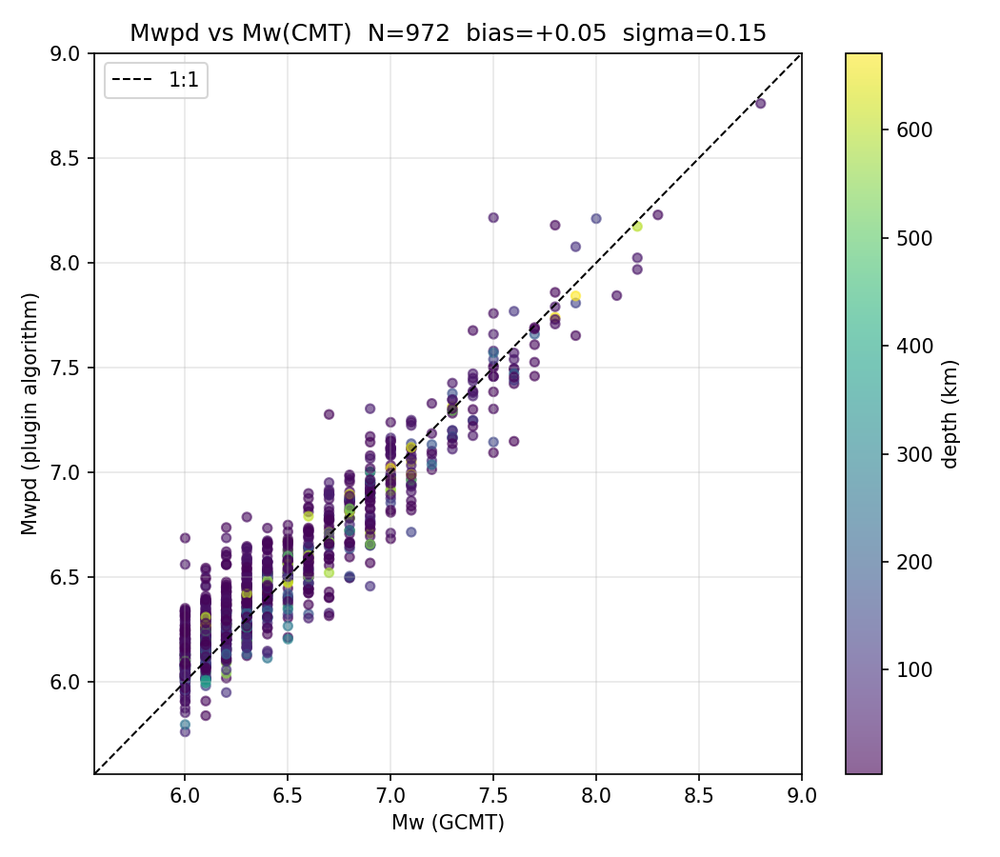

:math:`M_{wpd}` is a per-station **duration--amplitude moment magnitude** for
large earthquakes, determined from teleseismic *P* waveforms. It integrates the
broad-band *P*-wave ground displacement over the apparent source duration
:math:`T_0`, after Lomax & Michelini (2009), and is a port of the Mwpd
implementation in Early-est (A. Lomax). Because it integrates over the whole
source duration rather than taking the peak (as :math:`M_{wp}` does), it does
**not saturate** for great earthquakes.

The plugin contributes both an amplitude processor and a magnitude processor of
type ``Mwpd``. Both use the vertical broad-band component only.

Method
======

Given the far-field *P* displacement :math:`u(t)` for a source of duration
:math:`T_0`, the scalar seismic moment is (Tsuboi et al. 1995; Lomax &
Michelini 2009)

.. math::

   M_0 = C_M \int_{t_P}^{t_P + T_0} u(t)\, \mathrm{d}t ,

where :math:`t_P` is the *P*-arrival time. The implementation accumulates the
running displacement integral separately over its **positive and negative
lobes** (to separate the direct *P* wave from later reflected/secondary phases
of opposite polarity, eq. 3 of the paper) and uses the larger of the two at
:math:`T_0`. The moment magnitude follows the standard relation

.. math::

   M_{wpd}^{\mathrm{raw}} = \tfrac{2}{3}\left(\log_{10} M_0 - 9.1\right)
                            - C_\Delta(\Delta, h) ,

with a distance correction :math:`C_\Delta` (INGV/Early-est, subtracted; zero
for :math:`h>100` km), then a PREM step depth correction :math:`C_h(h)` and a
moment-scaling term for great/slow events:

.. math::

   M_{wpd} = M_{wpd}^{\mathrm{raw}} + C_h(h)
             + r\,(M_{wpd}^{\mathrm{raw}} - 7.2)\cdot 0.45 ,
   \qquad r = \mathrm{clip}\!\left(\tfrac{T_0-90}{110-90},\,0,\,1\right).

The duration ramp :math:`r` engages only for :math:`T_0 > 90` s (the moment
scaling for large interplate-thrust / tsunamigenic events, eq. 5a).

Amplitude
=========

For each *P* pick on the vertical broad-band, the amplitude processor:

#. restitutes counts to ground velocity (sensitivity gain) and high-passes with
   a Butterworth filter at a **0.005 Hz** corner (the Early-est BRB-HP filter);
   a low corner is essential to retain the long-period displacement that
   carries the moment of great earthquakes;
#. single-integrates to displacement and accumulates the running double
   integral into positive/negative lobes;
#. estimates the **apparent source duration** :math:`T_0` from the
   high-frequency envelope: the velocity is band-passed 1--5 Hz, squared and
   boxcar-smoothed, and :math:`T_0` is derived from the times at which this
   envelope last drops below 90/80/50/20 % of its peak;
#. integrates over :math:`\min(T_0,\ t_S-t_P,\ \mathtt{maxDuration})` --- the
   :math:`S\!-\!P` cap (from a travel-time table) keeps the integral free of
   *S* and surface-wave energy.

The amplitude carries the displacement integral (unit ``nm*s``); :math:`T_0` is
carried as the amplitude period. Computation is progressive: the value is
updated as data stream in and finalised once :math:`T_0` is resolved.

Magnitude
=========

The magnitude processor reads the displacement integral (``nm*s``) and
:math:`T_0` (period) and applies the relations above, with the moment constant

.. math::

   C_M = 4\pi\,\rho\,V_p^{3}\,F_p \cdot \tfrac{10000}{90}\cdot 1000
       \approx 4.68\times10^{21}

(Tsuboi constant; :math:`\rho=3400`, :math:`V_p=7900`, :math:`F_p=2`). As
:math:`M_{wpd}` is already a moment magnitude, the network estimation is the
identity; the network magnitude is a robust (median/trimmed) average.

Calibration
===========

The implementation was validated against GCMT moment magnitudes for 972 events
(:math:`M_w` 6.0--8.8, 2015--2026), processed through this algorithm with
broad-band stations from global networks. :math:`M_{wpd}` tracks
:math:`M_w^{\mathrm{CMT}}` along the 1:1 line with **no saturation** and no
significant depth dependence.

   :math:`M_{wpd}` (this plugin) versus GCMT :math:`M_w` for 972 events,
   coloured by source depth. Overall slope 1.02, mean difference +0.05,
   :math:`\sigma = 0.15`, correlation r = 0.95.

Mean difference :math:`M_{wpd} - M_w^{\mathrm{CMT}}` by magnitude band:

=============  ======  =====  ====
:math:`M_w`    mean    sigma  N
=============  ======  =====  ====
6.0 -- 7.0     +0.07   0.14   831
7.0 -- 7.5     -0.05   0.13    94
7.5 -- 8.0     -0.04   0.20    40
8.0 -- 9.5     -0.09   0.16     7
=============  ======  =====  ====

and by source depth:

================  ======  =====  ====
depth (km)        mean    sigma  N
================  ======  =====  ====
0 -- 70           +0.07   0.16   702
70 -- 300         -0.02   0.13   175
300 -- 800        +0.01   0.10    95
================  ======  =====  ====

These results are consistent with operational Early-est (slope ~1.01,
:math:`\pm 0.13`) and with Lomax & Michelini (2009), which reports
:math:`M_{wpd}` matching :math:`M_w^{\mathrm{CMT}}` within :math:`\pm 0.2`.

Configuration
=============

Add ``mwpd`` to the ``plugins`` parameter and enable the ``Mwpd`` amplitude and
magnitude in :ref:`scamp` / :ref:`scmag` (or :ref:`scolv`). The defaults
reproduce Early-est; the most important amplitude parameter is
``amplitudes.Mwpd.highpassCorner`` (0.005 Hz --- keep low). See the binding
parameter descriptions for the full list. Because :math:`M_{wpd}` integrates
over the source duration, it requires a long post-*P* window (up to
``maxDuration``), so the final value has higher latency than :math:`M_{wp}`.

References
==========

* Lomax, A. & Michelini, A. (2009). :math:`M_{wpd}`: a duration--amplitude
  procedure for rapid determination of earthquake magnitude and tsunamigenic
  potential from *P* waveforms. *Geophys. J. Int.* **176**, 200--214,
  doi:10.1111/j.1365-246X.2008.03974.x
* Tsuboi, S. et al. (1995). Rapid determination of :math:`M_w` from broadband
  *P* waveforms. *Bull. Seismol. Soc. Am.* **85**, 606--613.
